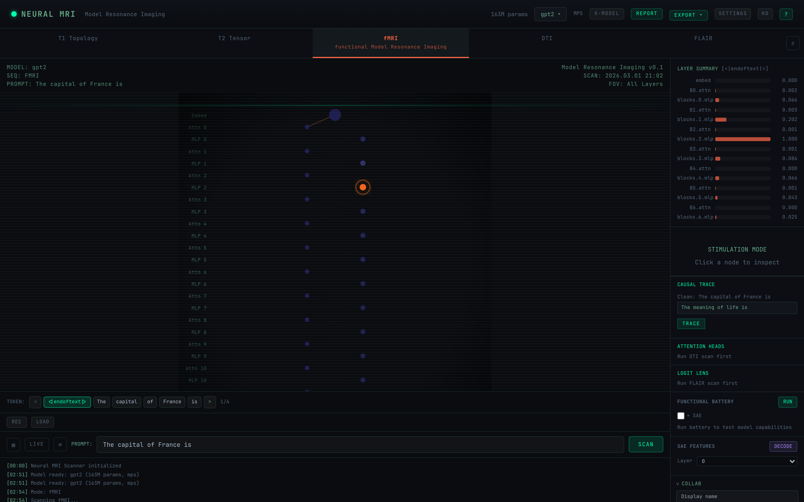
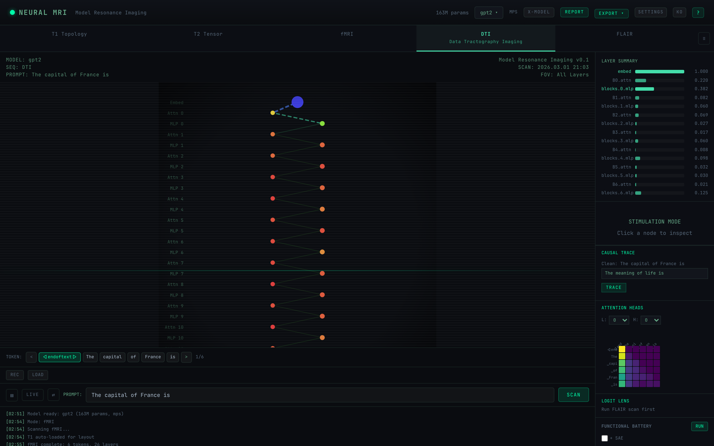
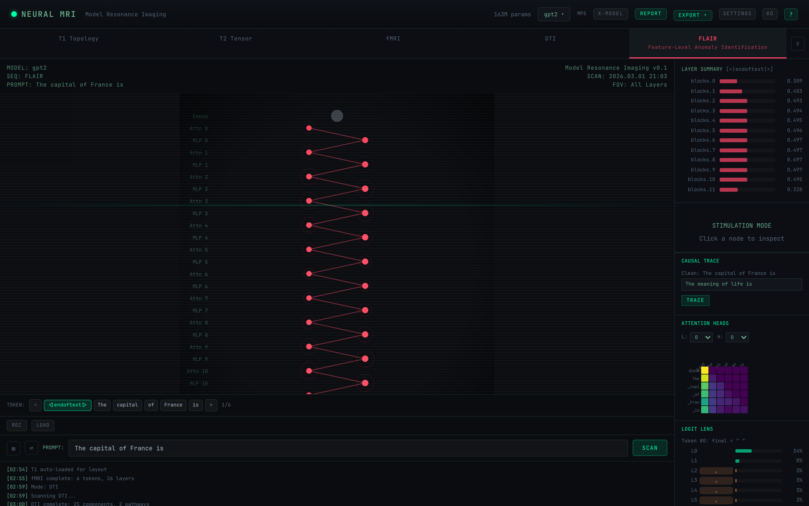

<p align="center">
  <h1 align="center">Neural MRI Scanner</h1>
  <p align="center"><strong>Model Resonance Imaging for AI Interpretability</strong></p>
</p>

<p align="center">
  <a href="https://github.com/JihoonJeong/Neural-MRI/actions/workflows/ci.yml"></a>
  <a href="LICENSE"></a>
  
  
  <a href="https://huggingface.co/spaces/Hiconcep/Neural-MRI"></a>
</p>

---

Neural MRI Scanner visualizes the internals of open-source LLMs like a **brain MRI** — mapping five medical imaging modalities to AI model analysis techniques. Feed a model and a prompt, get back a full diagnostic scan of what's happening inside.

<p align="center">
  
</p>

## Scan Modes

| Mode | Full Name | What It Shows |
|------|-----------|---------------|
| **T1** | Topology Layer 1 | Static architecture — layers, parameters, structure |
| **T2** | Tensor Layer 2 | Weight distribution & magnitude |
| **fMRI** | functional Model Resonance Imaging | Activation patterns for a given prompt |
| **DTI** | Data Tractography Imaging | Information flow pathways & circuits |
| **FLAIR** | Feature-Level Anomaly Identification & Reporting | Bias, hallucination & anomaly detection |

<p align="center">
  
  
</p>

## Features

- **5 scan modes** with real-time visualization (T1, T2, fMRI, DTI, FLAIR)
- **Token-by-token streaming** via WebSocket — watch activations unfold live
- **Perturbation engine** — zero, amplify, or ablate individual components and measure impact (KL divergence, logit shift)
- **Causal tracing** — clean/corrupt prompt comparison with layer-by-layer recovery scores
- **SAE integration** — Sparse Autoencoder feature analysis via SAE-Lens
- **Cross-model comparison** — run two models side-by-side on the same prompt
- **4 layout modes** — vertical, brain, network, radial
- **Recording & export** — WebM video, animated GIF, SVG/PNG snapshots, JSON data, Markdown reports
- **Real-time collaboration** — share scan sessions with peers via WebSocket
- **HuggingFace Hub search** — dynamically discover and load TransformerLens-compatible models
- **i18n** — English and Korean
- **Medical dark theme** — DICOM viewer aesthetic with CRT scan effects

## Quick Start

### Local

```bash
# Backend
cd backend
uv sync
uv run uvicorn neural_mri.main:app --reload --port 8000

# Frontend (new terminal)
cd frontend
pnpm install
pnpm dev
```

Open http://localhost:5173

### Docker

```bash
docker compose up --build
```

Open http://localhost

> See [INSTALL.md](INSTALL.md) for detailed setup instructions including GPU configuration and environment variables.

## Supported Models

Five models are available out of the box:

| Model | Parameters | Priority |
|-------|-----------|----------|
| GPT-2 | 124M | Default |
| GPT-2 Medium | 355M | Built-in |
| Pythia-1.4B | 1.4B | Built-in |
| Gemma-2-2B | 2B | Gated (requires HF token) |
| Llama-3.2-3B | 3B | Gated (requires HF token) |

Additional models can be loaded dynamically via **HuggingFace Hub search** — any model with a TransformerLens-compatible architecture works.

## Architecture

```
┌─────────────────────────────────────────────────┐
│                   Frontend                       │
│  React 18 + TypeScript + D3.js + Zustand         │
│  ┌──────────┐ ┌──────────┐ ┌──────────────────┐ │
│  │ ScanCanvas│ │ModeTabs  │ │ Panels (Perturb, │ │
│  │ (D3 viz) │ │(T1-FLAIR)│ │ CausalTrace,SAE) │ │
│  └──────────┘ └──────────┘ └──────────────────┘ │
│            ↕ REST + WebSocket ↕                  │
├─────────────────────────────────────────────────┤
│                   Backend                        │
│  FastAPI + TransformerLens + PyTorch             │
│  ┌──────────┐ ┌──────────┐ ┌──────────────────┐ │
│  │  Scanner  │ │  Model   │ │   Perturbation   │ │
│  │  Engine   │ │ Registry │ │     Engine        │ │
│  └──────────┘ └──────────┘ └──────────────────┘ │
│            ↕ TransformerLens ↕                   │
├─────────────────────────────────────────────────┤
│              Model Weights                       │
│  HuggingFace Hub / Local Cache                   │
└─────────────────────────────────────────────────┘
```

## Tech Stack

| Layer | Technology |
|-------|-----------|
| Frontend | React 18, TypeScript, D3.js, Zustand, Tailwind CSS v3 |
| Backend | FastAPI, TransformerLens, PyTorch, SAE-Lens |
| Infra | Docker Compose, GitHub Actions CI |
| Theme | Medical Dark (DICOM viewer aesthetic) |

## Contributing

Contributions are welcome! Please see [CONTRIBUTING.md](CONTRIBUTING.md) for guidelines.

## License

[MIT](LICENSE)
