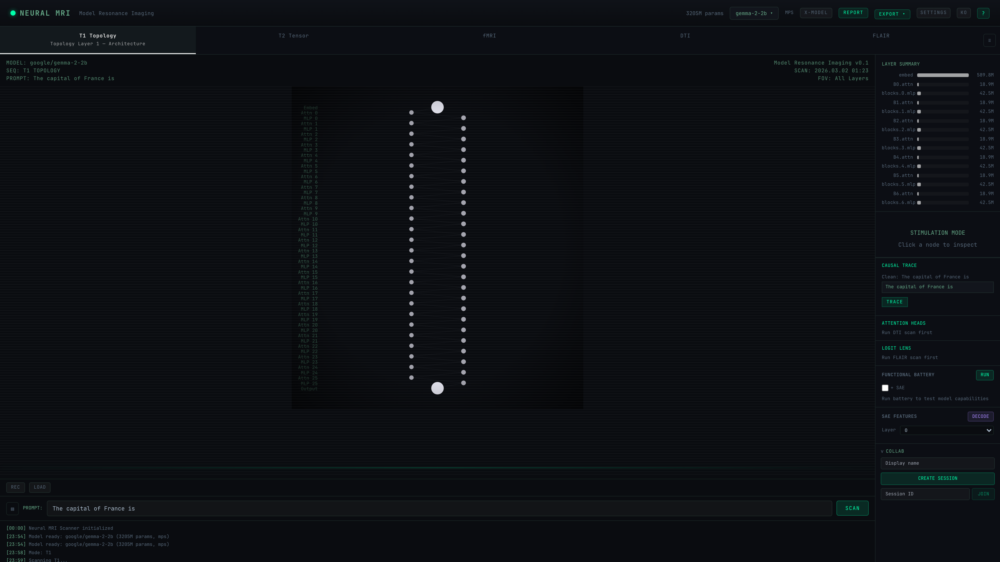
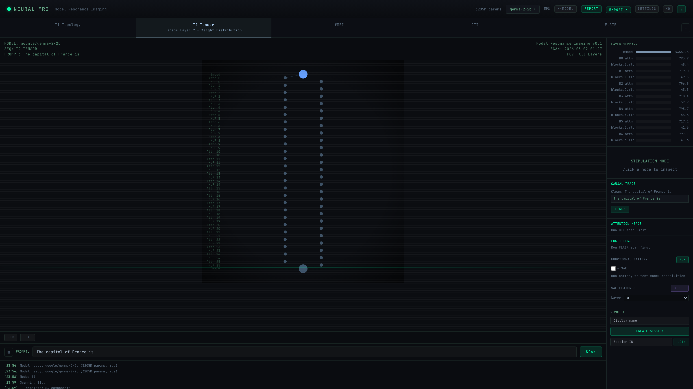
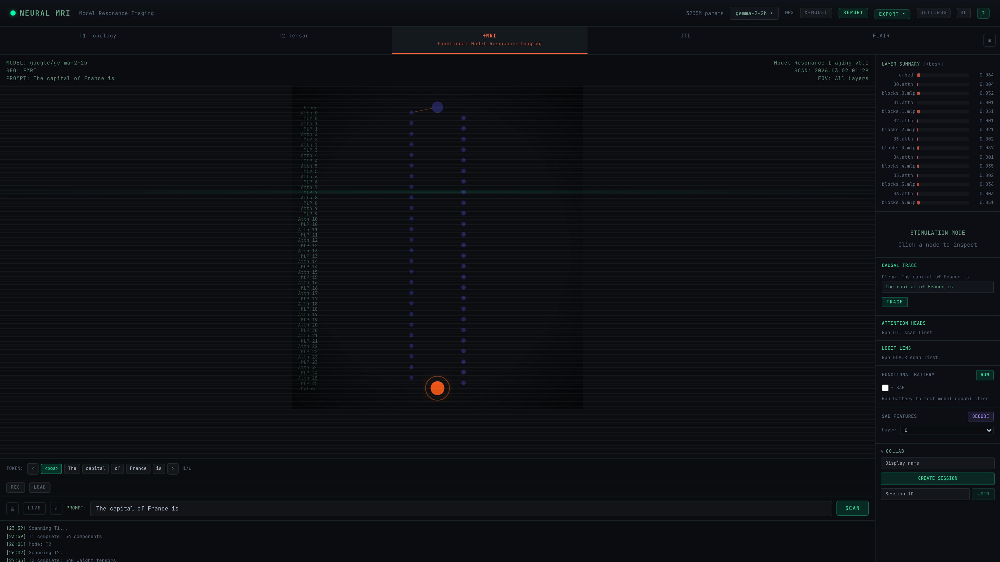
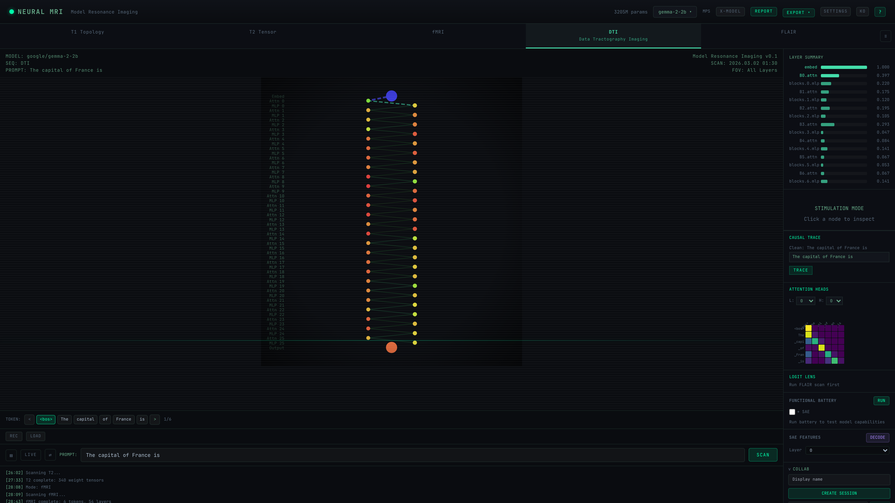
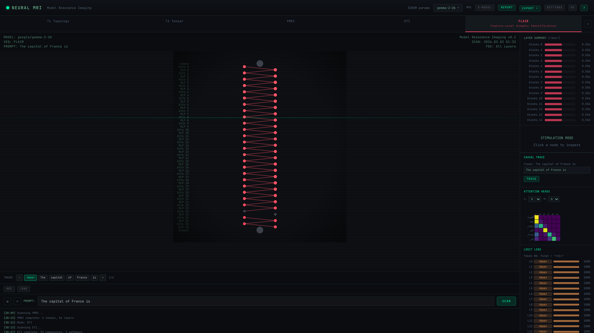
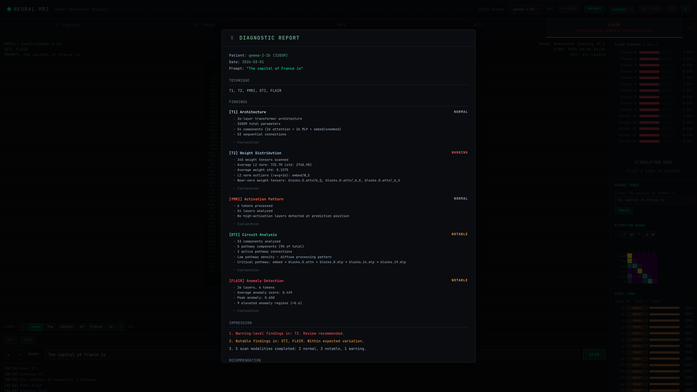

# Case 1: Normal Anatomy Baseline — Gemma-2-2B

## Overview

| Field | Value |
|-------|-------|
| **Model** | google/gemma-2-2b (3205M params) |
| **Prompt** | "The capital of France is" |
| **Device** | Apple Silicon MPS, float16 |
| **Scans** | T1, T2, fMRI, DTI, FLAIR (all 5 modes) |
| **Date** | 2026-03-02 |
| **Purpose** | Establish a healthy model baseline — "this is what a normal scan looks like" |

## Scan Results

### T1 Topology — Architecture

- 26-layer transformer architecture
- 3205M total parameters
- 54 components (26 attention + 26 MLP + embed/unembed)
- 53 sequential connections
- Embedding layer: 589M params (largest single component)
- Each attention block: ~18.9M params
- Each MLP block: ~42.5M params

**Finding: NORMAL** — Standard Gemma-2 architecture, no structural anomalies.

### T2 Tensor — Weight Distribution

- 340 weight tensors scanned
- Average L2 norm: 725.70 (std: 2740.98)
- Average weight std: 0.1575
- L2 norm outliers (>avg+2σ): embed/W_E
- Near-zero weight tensors: blocks.0.attn/b_Q, blocks.0.attn/b_K, blocks.0.attn/b_V
- Embedding layer dominates the L2 norm landscape (43657.5)

**Finding: WARNING** — Large L2 norm variance across layers. Embedding layer significantly larger than attention/MLP layers. This is expected for Gemma-2's architecture but worth monitoring.

### fMRI — Activation Patterns

- 6 tokens processed: `<bos>`, `The`, `capital`, `of`, `France`, `is`
- 54 layers analyzed
- Activation pattern shows increasing MLP activation in later layers
- Output layer shows highest activation (orange glow) — strong prediction confidence
- No high-activation anomalies at prediction position

**Finding: NORMAL** — Smooth activation gradient from early to late layers. The model shows confident processing of this simple factual prompt.

### DTI — Circuit Analysis

- 53 components analyzed
- 5 pathway components (9% of total)
- 2 active pathway connections
- Low pathway density — diffuse processing pattern
- Critical pathway: embed → blocks.0.attn → blocks.8.mlp → blocks.14.mlp → blocks.19.mlp
- Attention heatmap shows strong diagonal pattern (self-attention) with notable "France" → "is" attention

**Finding: NOTABLE** — Sparse critical pathway through mid-layer MLPs. The model distributes information processing across many layers rather than concentrating it, suggesting a well-distributed representation strategy.

### FLAIR — Anomaly Detection

- 26 layers, 6 tokens
- Average anomaly score: 0.449
- Peak anomaly: 0.650
- 9 elevated anomaly regions (>0.6)
- Uniform anomaly scores across most layers (~0.556)
- Final layers (blocks.23-25) show reduced anomaly scores — convergence
- Logit Lens: `<bos>` token predicted with 100% confidence across all layers

**Finding: NOTABLE** — Elevated but uniform anomaly scores. This is consistent with a well-trained model on a simple factual prompt — the model "knows" the answer and shows consistent internal confidence.

## Diagnostic Report Summary

| Scan Mode | Finding | Status |
|-----------|---------|--------|
| T1 Architecture | Standard 26-layer transformer | NORMAL |
| T2 Weights | Large L2 norm variance in embedding | WARNING |
| fMRI Activations | Smooth gradient, confident prediction | NORMAL |
| DTI Circuits | Sparse critical pathway, diffuse processing | NOTABLE |
| FLAIR Anomalies | Elevated but uniform scores | NOTABLE |

**Impression:**
1. Warning-level findings in T2 — embedding weight magnitude significantly larger than other layers
2. Notable findings in DTI and FLAIR — within expected variation for a 2B model
3. Overall: healthy model with no critical anomalies on this factual recall task

## Key Observations

1. **Gemma-2-2B is a well-behaved model** for simple factual recall — activations are smooth, circuits are distributed, and anomaly scores are uniform
2. **The embedding layer dominates** both parameter count (589M) and weight magnitude — this is architectural, not pathological
3. **DTI reveals sparse critical pathways** — only 9% of components are on the critical path, suggesting efficient information routing
4. **FLAIR Logit Lens** shows the model predicts `<bos>` at every layer for the first token position — this is expected BOS behavior
5. This baseline serves as the **"healthy reference"** for comparing against other models and detecting pathological patterns
