# Case 2: Cross-Model Comparative Study — Gemma vs Llama vs Qwen

## Overview

| Field | Value |
|-------|-------|
| **Models** | Gemma-2-2B (3205M), Llama-3.2-3B (3607M), Qwen2.5-3B (3398M) |
| **Prompts** | Factual, Reasoning, Creative (3 types) |
| **Scans** | fMRI (activations), DTI (circuits) |
| **Device** | Apple Silicon MPS, float16 |
| **Date** | 2026-03-02 |
| **Purpose** | Compare internal processing patterns across model families — "same symptom, different anatomy" |

## Experimental Design

| Prompt Type | Text | Cognitive Analog |
|-------------|------|------------------|
| **Factual** | "The capital of France is" | Memory recall |
| **Reasoning** | "If all roses are flowers and some flowers fade quickly, then" | Logical inference |
| **Creative** | "Once upon a time in a land of" | Generative imagination |

Each model was scanned with all 3 prompts × 2 modes (fMRI + DTI) = 6 scans per model, 18 total.

---

## Model Profiles

### Architecture Comparison

| Property | Gemma-2-2B | Llama-3.2-3B | Qwen2.5-3B |
|----------|-----------|-------------|------------|
| **Layers** | 26 | 28 | 36 |
| **Parameters** | 3205M | 3607M | 3398M |
| **Family** | Google Gemma | Meta Llama | Alibaba Qwen |
| **BOS Token** | `<bos>` | `<begin_of_text>` | _(none)_ |
| **Tokens (factual)** | 6 (`<bos>` + 5) | 6 (`<bot>` + 5) | 5 (no BOS) |
| **Gated** | Yes | Yes | No |

---

## fMRI Results — Activation Patterns

### Gemma-2-2B: Diffuse Processing

| Prompt | Scan |
|--------|------|
| Factual | 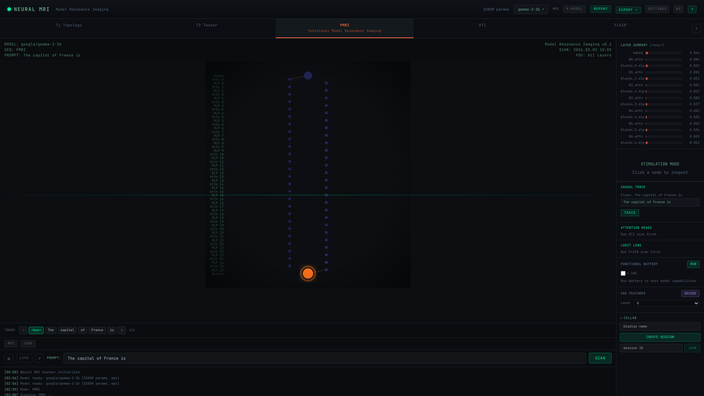 |
| Reasoning |  |
| Creative | 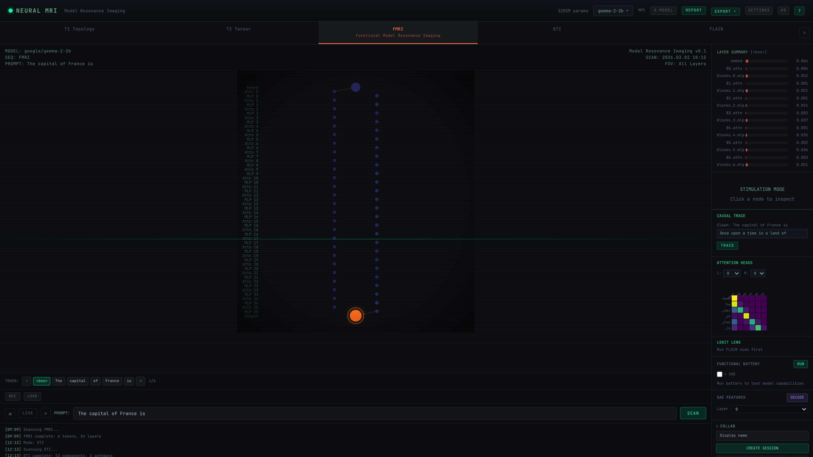 |

**Observations:**
- Uniformly low activation scores across all layers (0.001–0.064)
- Embed layer shows highest activation at 0.064 — minimal downstream amplification
- Large orange output node indicates confident final prediction
- **Prompt-invariant**: factual, reasoning, and creative prompts produce nearly identical activation landscapes at the `<bos>` token
- No early-layer MLP hotspots — processing is distributed

**Profile: DIFFUSE** — Gemma distributes activation evenly across layers without concentrating computation at any point. Among the three models, it shows the lowest peak activation and the smoothest gradient.

### Llama-3.2-3B: Early MLP Spike

| Prompt | Scan |
|--------|------|
| Factual | 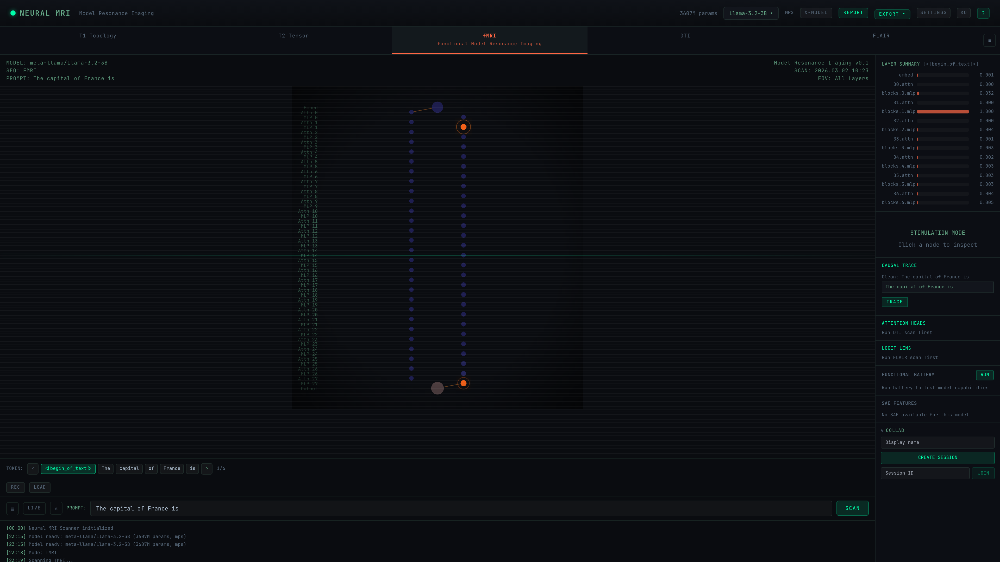 |
| Reasoning | 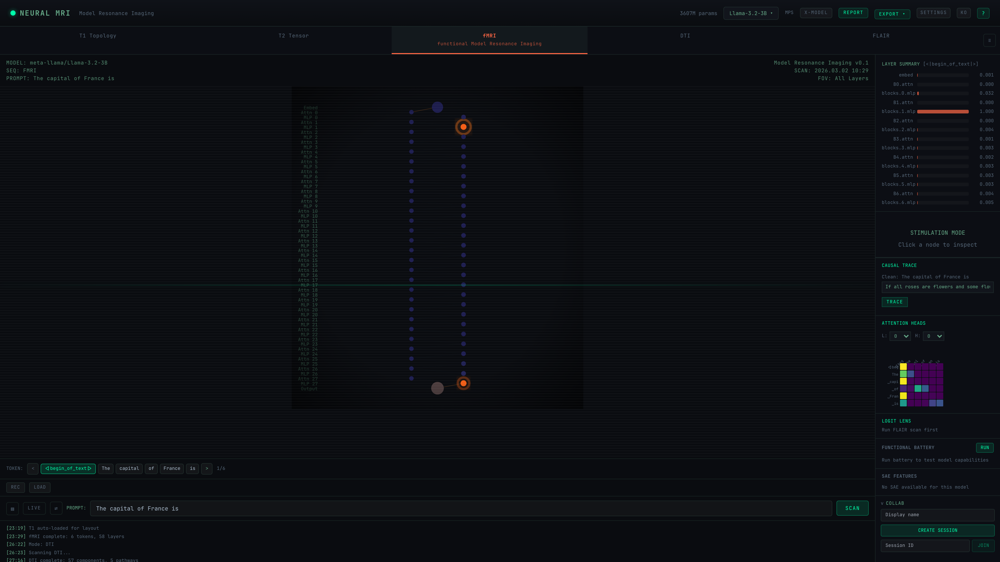 |
| Creative | 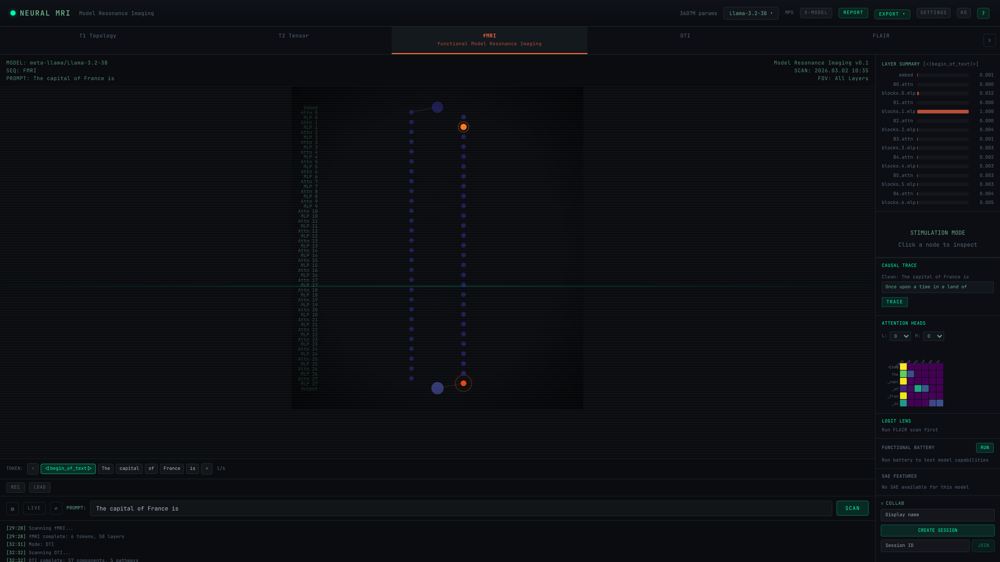 |

**Observations:**
- **blocks.1.mlp = 1.000** — maximum activation at the very first MLP layer
- blocks.0.mlp = 0.832 — also very high
- All other layers < 0.01 — dramatic concentration of computation
- Dual output nodes visible (gray + orange) — split logit pathway
- **Prompt-invariant**: the blocks.1.mlp hotspot persists across all 3 prompt types
- Attention layers show near-zero activation (all < 0.005)

**Profile: FRONT-LOADED** — Llama concentrates nearly all processing in the first two MLP layers, then maintains minimal activation through remaining layers. The sharpest activation peak among the three models.

### Qwen2.5-3B: Mid-Early Peak with Dense Distribution

| Prompt | Scan |
|--------|------|
| Factual | 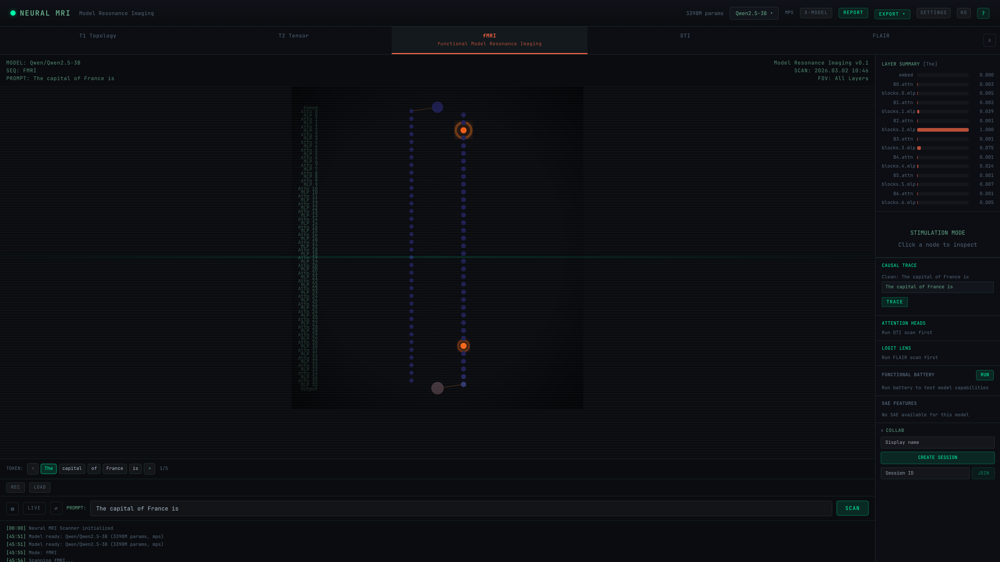 |
| Reasoning | 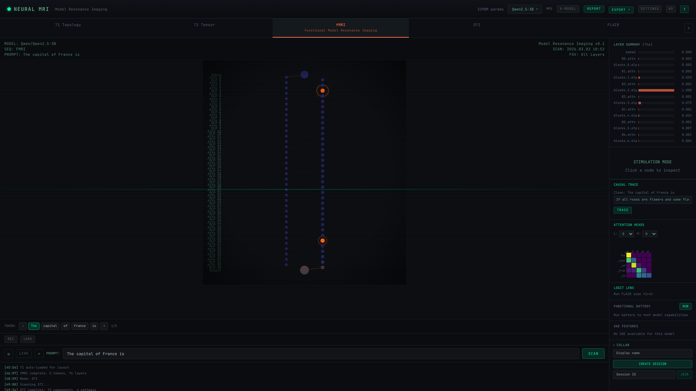 |
| Creative | 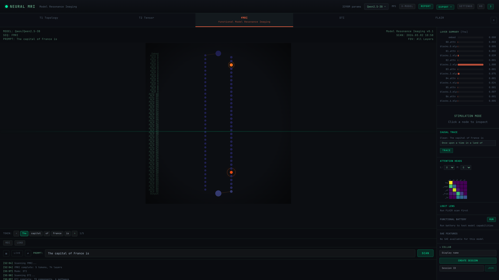 |

**Observations:**
- **blocks.2.mlp = 1.000** — peak activation at the third MLP layer
- blocks.1.mlp = 0.039, blocks.3.mlp = 0.075 — moderate secondary peaks
- Denser activation column overall — more nodes visible than other models
- 36-layer architecture creates a taller, more detailed visualization
- Secondary activation peak visible in mid-layers (~block 18-19)
- No BOS token — Qwen tokenizer starts directly with "The"

**Profile: PEAKED + DISTRIBUTED** — Qwen shares Llama's early-layer MLP peak but adds secondary activations in mid-layers. The deepest architecture (36 layers) among the three, showing the most fine-grained processing stages.

---

## DTI Results — Circuit Analysis

### Gemma-2-2B: Sparse Circuits, Few Pathways

| Prompt | Scan |
|--------|------|
| Factual |  |
| Reasoning | 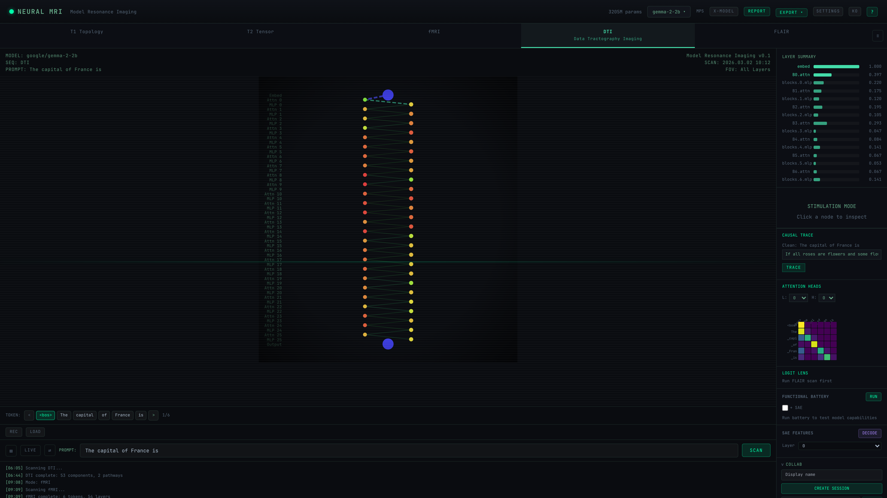 |
| Creative |  |

**Observations:**
- Embed = 1.000, gradual decay through layers
- Color gradient: green (top) → yellow → orange → red (mid) → green (bottom)
- B0.attn = 0.399, B2.attn = 0.295 — moderate attention importance
- MLP importance peaks at blocks.3.mlp (0.047) and blocks.6.mlp (0.141)
- Attention heatmap shows strong diagonal (self-attention) with BOS column
- 53 components, 2 pathways

**Profile: SPARSE & BALANCED** — Fewest pathways (2) and smoothest importance decay of the three models. Attention and MLP contributions are roughly balanced. From another perspective, the low pathway count could indicate under-utilization of available capacity.

### Llama-3.2-3B: MLP-Dominant Circuits, Most Pathways

| Prompt | Scan |
|--------|------|
| Factual | 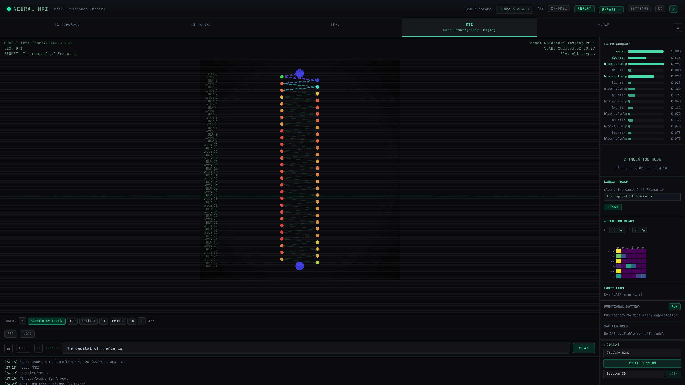 |
| Reasoning | 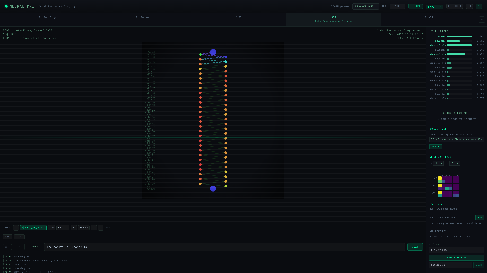 |
| Creative | 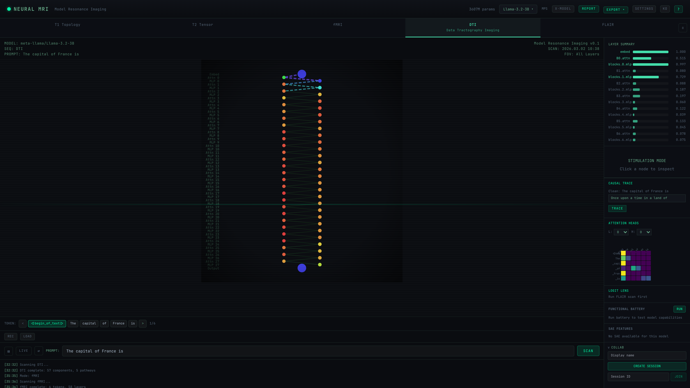 |

**Observations:**
- Embed = 1.000, blocks.0.mlp = 0.997 — near-maximum early MLP importance
- blocks.1.mlp = 0.729 — strong secondary MLP pathway
- Attention layers show moderate importance: B0.attn = 0.510, B1.attn = 0.149
- Color pattern: green/cyan (top) → yellow → orange → red (mid) → orange (bottom)
- Attention heatmap similar to Gemma — diagonal with BOS attention
- 58 layers (28 attn + 28 mlp + embed/unembed), 6 pathways

**Profile: MLP-DOMINANT** — DTI confirms the fMRI finding: the first two MLP layers are critical circuit components. Moderate pathway count (6) — the most pathway-rich of the three models. Strong MLP reliance with attention playing a secondary role.

### Qwen2.5-3B: Attention-Dominant, Dense Importance

| Prompt | Scan |
|--------|------|
| Factual | 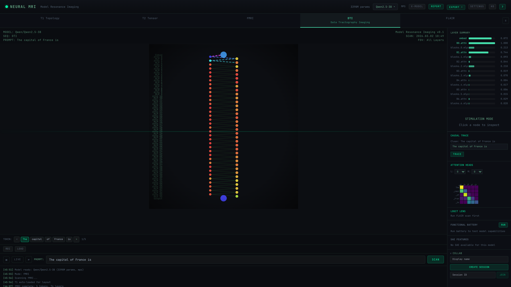 |
| Reasoning |  |
| Creative |  |

**Observations:**
- B0.attn = 1.000 — attention layer 0 is the most critical component
- B1.attn = 0.743 — strong secondary attention pathway
- blocks.2.mlp = 0.220 — the fMRI hotspot is also a DTI critical node
- **Predominantly red activation column** — nearly all components show high importance
- Fewer visible green/yellow nodes — more uniform high-importance distribution
- Attention heatmap shows 4-token matrix (no BOS) with distinctive pattern
- 73 components, 4 pathways

**Profile: ATTENTION-DOMINANT & DENSE** — Highest component importance uniformity of the three models. Nearly all components contribute to critical pathways (4 pathways). Attention layers dominate over MLP. The dense distribution could indicate either thorough utilization of capacity or reduced redundancy — interpretable in opposite directions depending on baseline assumptions (see Discussion).

---

## Comparative Analysis

### fMRI Activation Profiles

| Metric | Gemma-2-2B | Llama-3.2-3B | Qwen2.5-3B |
|--------|-----------|-------------|------------|
| **Peak layer** | embed (0.064) | blocks.1.mlp (1.000) | blocks.2.mlp (1.000) |
| **Peak location** | Embedding | Early MLP | Early MLP |
| **Activation spread** | Diffuse | Front-loaded | Front-loaded + distributed |
| **Attn activation** | Low (~0.003) | Near-zero (<0.005) | Near-zero (<0.005) |
| **Output node** | Single (orange) | Dual (gray + orange) | Single (orange) |
| **Prompt sensitivity** | None | None | None |

### DTI Circuit Profiles

| Metric | Gemma-2-2B | Llama-3.2-3B | Qwen2.5-3B |
|--------|-----------|-------------|------------|
| **Critical component** | embed (1.000) | embed + MLP0 (0.997) | B0.attn (1.000) |
| **Pathways** | 2 | 6 | 4 |
| **Circuit density** | Sparse | Moderate | Dense |
| **Color pattern** | Green→Red→Green | Green→Red→Orange | Red throughout |
| **Dominant type** | Balanced | MLP-dominant | Attention-dominant |

### Key Findings

1. **Architecture shapes processing**: Despite similar parameter counts (3.2-3.6B), these models show fundamentally different internal processing strategies
2. **Early MLP hotspot**: Both Llama and Qwen concentrate activation in early MLP layers, while Gemma distributes processing — this may reflect different pre-training strategies
3. **Prompt invariance at BOS**: At the `<bos>` token position, all models show identical activation patterns regardless of prompt type — the model hasn't "read" the prompt yet at position 0
4. **Circuit density correlates with depth**: Qwen (36 layers) shows the densest circuits, Gemma (26 layers) the sparsest — deeper models may distribute importance more evenly
5. **Attention vs MLP dominance**: Qwen's DTI is attention-dominant (B0.attn = 1.000), Llama's is MLP-dominant (MLP0 = 0.997), Gemma is balanced — different families rely on different component types
6. **Tokenizer matters**: BOS token handling varies — Gemma (`<bos>`), Llama (`<begin_of_text>`), Qwen (none) — this affects activation patterns at position 0

---

## Comparative Summary

| Model | fMRI Profile | DTI Profile | Processing Strategy |
|-------|-------------|-------------|---------------------|
| Gemma-2-2B | Diffuse — lowest peak, smoothest gradient | Sparse & Balanced — 2 pathways | Distributed processing |
| Llama-3.2-3B | Front-loaded — sharpest peak at MLP 0-1 | MLP-dominant — 6 pathways | Early-stage concentration |
| Qwen2.5-3B | Peaked + distributed — early peak + mid-layer activity | Attention-dominant & Dense — 4 pathways | Attention-driven with depth |

---

## Discussion: The Baseline Problem

A critical methodological note: **the notion of "normal" depends entirely on which model you choose as the reference.**

### If Gemma is the baseline...

| Model | Interpretation |
|-------|---------------|
| Gemma | Normal — smooth, diffuse, balanced |
| Llama | Abnormal — suspiciously concentrated activation in early layers |
| Qwen | Warning — dangerously dense circuits with low redundancy |

### If Qwen is the baseline...

| Model | Interpretation |
|-------|---------------|
| Qwen | Normal — thorough utilization of all layers, rich attention circuits |
| Llama | Abnormal — most of the architecture sits idle after layer 1 |
| Gemma | Warning — suspiciously sparse circuits (only 2 pathways), possible under-utilization of capacity |

### If Llama is the baseline...

| Model | Interpretation |
|-------|---------------|
| Llama | Normal — efficient front-loading with minimal wasted computation |
| Gemma | Abnormal — no clear processing focus, diffuse and potentially inefficient |
| Qwen | Abnormal — over-distributed processing across too many layers |

This demonstrates that **"healthy" vs "pathological" in model interpretability is not an absolute judgment** — it is always relative to an assumed reference architecture. In neuroscience, the same issue exists: what constitutes a "normal brain" depends on the population sampled. A brain optimized for spatial reasoning looks different from one optimized for language, yet neither is pathological.

### Implications for Model Medicine

Rather than labeling models as normal or abnormal, we propose characterizing them along **architectural dimensions**:

| Dimension | Spectrum | Gemma | Llama | Qwen |
|-----------|----------|-------|-------|------|
| **Activation concentration** | Diffuse ↔ Focused | ← Diffuse | Focused → | Middle |
| **Processing depth** | Shallow ↔ Deep | Middle | ← Shallow | Deep → |
| **Circuit density** | Sparse ↔ Dense | ← Sparse | Middle | Dense → |
| **Component dominance** | MLP ↔ Attention | Balanced | ← MLP | Attention → |
| **Pathway count** | Few ↔ Many | ← Few (2) | Many → (6) | Middle (4) |

This spectral view avoids the baseline bias problem entirely. Each model occupies a position in a multi-dimensional space, and deviations become meaningful only when compared against the model's own expected behavior (e.g., before and after fine-tuning) or against a well-defined population of models within the same family.

---

## Clinical Interpretation

This cross-model study reveals that **model families have distinct "neural signatures"** visible through fMRI and DTI scans:

- **Gemma** occupies the diffuse/sparse end of the spectrum — distributed processing, few critical pathways, balanced component types. This could indicate either efficient distribution or under-utilization.
- **Llama** is the most concentrated — heavy early-layer MLP computation with remaining layers largely quiet. This is the most "specialized" processing strategy among the three.
- **Qwen** sits at the dense/attention-dominant end — the deepest architecture (36 layers) with the most uniform component importance. This could indicate either thorough capacity utilization or reduced fault tolerance.

**No model is inherently "healthier" than another.** The value of cross-model comparison lies in revealing the diversity of internal strategies — not in ranking them. Pathological findings should be reserved for cases where a model deviates from its *own* expected behavior (e.g., after training corruption, adversarial attack, or catastrophic forgetting).

### Methodological Notes

- **Prompt invariance at BOS**: At position 0, all models show identical activation patterns regardless of prompt type — expected, as subsequent tokens haven't been processed yet. To see prompt-specific effects, examine later token positions using the token stepper.
- **Normalization**: fMRI activations are min-max normalized per scan. A "1.000" peak in Llama and a "1.000" peak in Qwen are relative to their own ranges — not directly comparable in absolute magnitude.
- **Sample size**: N=3 models is insufficient for population-level claims. These findings characterize individual models, not model families.
