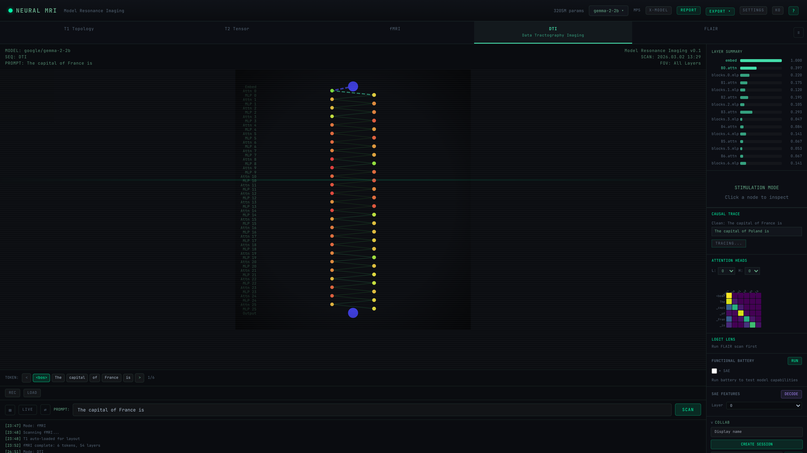
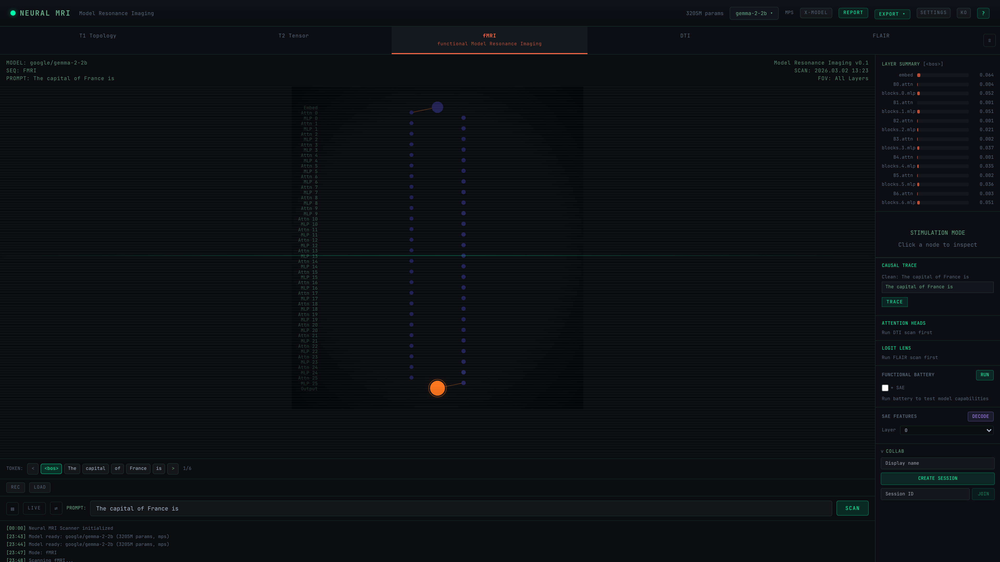
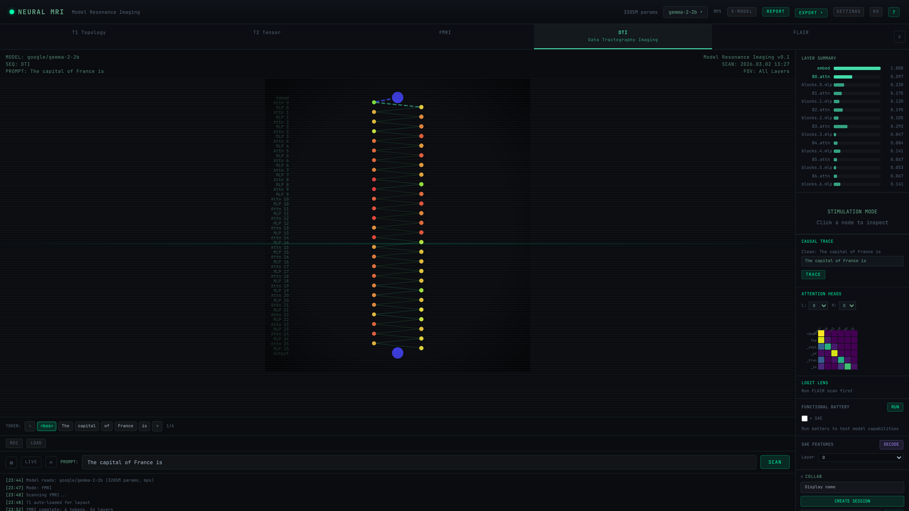
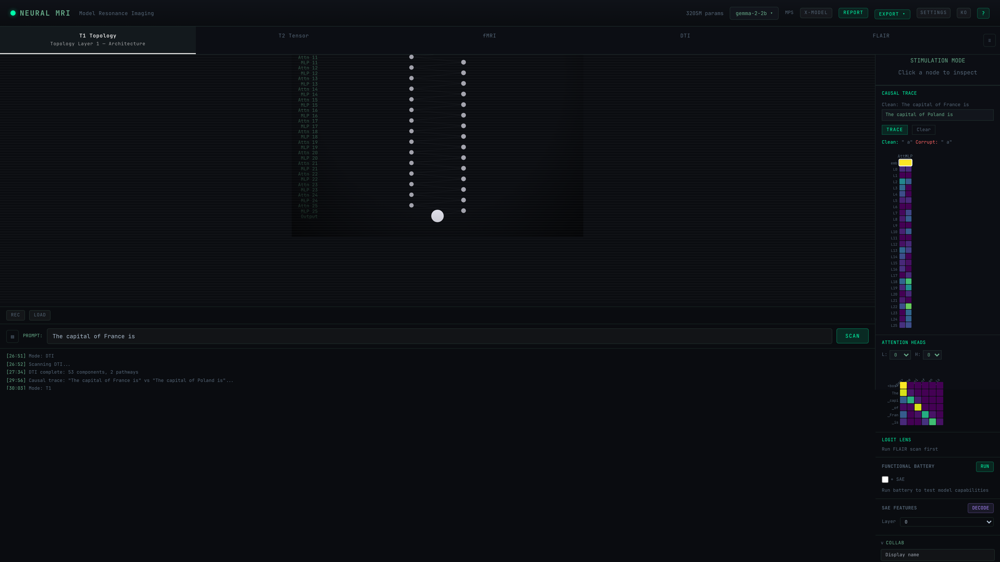

# Case 3: Perturbation Stress Test — Gemma-2-2B

## Overview

| Field | Value |
|-------|-------|
| **Model** | google/gemma-2-2b (3205M params) |
| **Prompt** | "The capital of France is" |
| **Device** | Apple Silicon MPS, float16 |
| **Tests** | 30 perturbations (10 components × 3 modes) + 2 causal traces |
| **Date** | 2026-03-02 |
| **Purpose** | Test model robustness by perturbing individual components — "stress test a healthy patient" |

## Motivation

In Case 2, we argued that **pathological findings should be based on a model's deviation from its own expected behavior**, not on cross-model comparison. This case tests that framework: we take the "healthy" Gemma-2-2B (our Case 1 baseline) and systematically stress it to see what breaks — and what doesn't.

---

## Experiment 1: Single-Component Perturbation Sweep

### Design

- **10 components** tested: 5 layers × 2 types (attn + mlp)
  - Early: blocks.0, blocks.5
  - Mid: blocks.12
  - Late: blocks.20, blocks.25
- **3 perturbation modes** per component:
  - **Zero-out**: Replace component output with zeros
  - **Amplify 2×**: Double component output magnitude
  - **Ablate**: Replace component output with mean activation
- **Metric**: logit difference (ΔL) and prediction change for "The capital of France is"

### Results

**All 30 perturbations produced no prediction change.** The model predicted " a" (start of "a city" / next-token continuation) in every case.

#### Logit Difference by Component and Mode

| Component | Zero (ΔL) | Amplify (ΔL) | Ablate (ΔL) |
|-----------|-----------|-------------|-------------|
| blocks.0.attn | **-0.813** | -0.156 | -0.078 |
| blocks.0.mlp | -0.438 | +0.188 | -0.188 |
| blocks.5.attn | +0.141 | -0.484 | +0.141 |
| blocks.5.mlp | -0.047 | -0.172 | -0.016 |
| blocks.12.attn | -0.078 | 0.000 | -0.063 |
| blocks.12.mlp | -0.266 | +0.031 | -0.125 |
| blocks.20.attn | +0.047 | **-0.766** | +0.063 |
| blocks.20.mlp | **-0.906** | +0.297 | -0.156 |
| blocks.25.attn | +0.406 | -0.469 | +0.453 |
| blocks.25.mlp | -0.266 | **-0.766** | +0.141 |

#### Probability Shifts

| Component | Zero (prob) | Amplify (prob) | Ablate (prob) | Original |
|-----------|-----------|-------------|-------------|----------|
| blocks.0.attn | 19.8% | 21.9% | 21.9% | 20.7% |
| blocks.0.mlp | 23.5% | 21.3% | 23.3% | 20.7% |
| blocks.5.attn | 21.0% | 20.6% | 20.7% | 20.7% |
| blocks.5.mlp | 22.4% | 18.0% | 21.4% | 20.7% |
| blocks.12.attn | 18.2% | 24.0% | 19.1% | 20.7% |
| blocks.12.mlp | 20.7% | 17.4% | 21.7% | 20.7% |
| blocks.20.attn | 21.1% | 19.9% | 21.1% | 20.7% |
| blocks.20.mlp | 24.7% | 17.9% | 22.8% | 20.7% |
| blocks.25.attn | 18.4% | 20.9% | 23.0% | 20.7% |
| blocks.25.mlp | 18.2% | **32.0%** | 20.4% | 20.7% |

### Interpretation

1. **No single component is a single point of failure.** Zeroing out any individual attn or mlp block does not change the top-1 prediction. Gemma distributes information processing redundantly.

2. **Highest impact**: Zero blocks.20.mlp (ΔL=-0.91) and zero blocks.0.attn (ΔL=-0.81). These are the "most important" components by this metric, but even their removal doesn't flip the prediction.

3. **Amplify blocks.25.mlp** produced the largest probability shift (20.7% → 32.0%) — doubling the final MLP's output boosts confidence, suggesting this layer plays a role in output calibration.

4. **Mid-layers are the most resilient**: blocks.12 perturbations produce near-zero logit differences, consistent with Case 1's DTI finding of sparse mid-layer pathways.

---

## Experiment 2: Causal Tracing

Causal tracing identifies which components carry information about specific facts. We inject clean activations into a corrupted forward pass, one component at a time, and measure how much of the correct prediction is recovered.

### Trace 1: "France" → "Poland" (Factual Substitution)

**Clean prompt**: "The capital of France is"
**Corrupt prompt**: "The capital of Poland is"
**Clean prediction**: " a" | **Corrupt prediction**: " a"

Since both France and Poland predict " a" (a common next-token continuation), recovery scores reveal which components encode the *country-specific* knowledge that differentiates the internal representations.



#### Recovery Score by Component (Top 15)

| Component | Type | Recovery | Location |
|-----------|------|----------|----------|
| embed | embed | **1.000** | Input |
| blocks.22.mlp | mlp | **0.767** | Late |
| blocks.18.mlp | mlp | **0.698** | Late |
| blocks.19.mlp | mlp | 0.488 | Late |
| blocks.2.attn | attn | 0.465 | Early |
| blocks.3.attn | attn | 0.326 | Early |
| blocks.13.attn | attn | 0.326 | Mid |
| blocks.18.attn | attn | 0.326 | Late |
| blocks.23.mlp | mlp | 0.326 | Late |
| blocks.24.mlp | mlp | 0.302 | Late |
| blocks.2.mlp | mlp | 0.279 | Early |
| blocks.8.mlp | mlp | 0.279 | Mid |
| blocks.10.mlp | mlp | 0.279 | Mid |
| blocks.4.attn | attn | 0.233 | Early |
| blocks.14.attn | attn | 0.233 | Mid |

**Key finding**: Factual knowledge about France is concentrated in **late MLP layers** (blocks.18, 19, 22) — the "factual recall circuits." These are the components that, when restored to their clean state, most recover the France-specific internal representation.

### Trace 2: "France" → Noise (Complete Corruption)

**Clean prompt**: "The capital of France is"
**Corrupt prompt**: "sdkfj woeir xcvn qpwo is"
**Clean prediction**: " a" | **Corrupt prediction**: "w"

Here the corrupt prompt is complete nonsense, so recovery scores reveal which components carry basic linguistic structure and semantic content.

#### Recovery Score by Component (Top 15)

| Component | Type | Recovery | Location |
|-----------|------|----------|----------|
| embed | embed | **1.000** | Input |
| blocks.0.mlp | mlp | **0.380** | Early |
| blocks.0.attn | attn | **0.310** | Early |
| blocks.3.mlp | mlp | 0.296 | Early |
| blocks.3.attn | attn | 0.252 | Early |
| blocks.22.mlp | mlp | 0.240 | Late |
| blocks.23.mlp | mlp | 0.240 | Late |
| blocks.24.mlp | mlp | 0.238 | Late |
| blocks.4.attn | attn | 0.234 | Early |
| blocks.20.mlp | mlp | 0.215 | Late |
| blocks.2.mlp | mlp | 0.172 | Early |
| blocks.1.mlp | mlp | 0.149 | Early |
| blocks.5.attn | attn | 0.138 | Early |
| blocks.5.mlp | mlp | 0.136 | Early |
| blocks.18.mlp | mlp | 0.132 | Late |

**Key finding**: Against complete corruption, **early layers** (blocks.0-5) become the most important — these carry basic linguistic structure. Late MLP layers (blocks.20-24) remain secondary contributors, carrying semantic content.

---

## Comparative: Factual vs Noise Corruption

| Dimension | France → Poland | France → Noise |
|-----------|----------------|----------------|
| **Critical region** | Late MLP (blocks.18-22) | Early layers (blocks.0-5) |
| **Max non-embed recovery** | 0.767 (blocks.22.mlp) | 0.380 (blocks.0.mlp) |
| **Recovery spread** | Concentrated in 3 late MLPs | Distributed across early layers |
| **Zero-recovery components** | 16 (30%) | 13 (25%) |
| **Interpretation** | Country-specific facts stored in late MLPs | Linguistic structure in early layers |

This reveals a **two-phase processing architecture** in Gemma-2-2B:

```
Early layers (0-5)     →  Linguistic structure, syntax, basic meaning
Mid layers (6-15)      →  Low importance (many zero-recovery)
Late layers (16-25)    →  Factual recall, knowledge retrieval
```

---

## Baseline Scans (Reference)

### fMRI Activation Baseline



### DTI Circuit Baseline



### T1 Architecture with Causal Trace Heatmap



The T1 view shows the causal trace heatmap on the right panel — each row is a layer, with two columns (attn, mlp). Brighter cells (green/yellow) indicate higher recovery scores. The late-layer MLP concentration is clearly visible.

---

## Diagnostic Summary

| Test | Result | Interpretation |
|------|--------|---------------|
| Single-component zero-out | 0/10 predictions changed | High redundancy |
| Single-component amplify | 0/10 predictions changed | Robust to amplification |
| Single-component ablate | 0/10 predictions changed | Robust to mean ablation |
| Max logit impact | ΔL = -0.91 (blocks.20.mlp zero) | Late MLP most sensitive |
| Max probability shift | 32.0% (blocks.25.mlp amplify) | Final MLP affects calibration |
| Causal trace (factual) | Late MLPs (18,19,22) critical | Knowledge in late layers |
| Causal trace (noise) | Early layers (0-5) critical | Structure in early layers |

**Overall**: Gemma-2-2B passes all stress tests. No single-component perturbation changes the prediction. The model shows **distributed redundancy** — a hallmark of robust architecture.

---

## Connecting to Case 2

Case 2 argued that "healthy vs pathological" depends on which model you choose as the baseline. Case 3 demonstrates the alternative: **compare a model against itself**.

- **Before perturbation**: Gemma predicts " a" with 20.7% probability
- **After worst-case perturbation**: Gemma still predicts " a" with 18.2-32.0% probability
- **Causal tracing**: Reveals a clear two-phase architecture (early=structure, late=knowledge)

This self-referential framework avoids the baseline bias problem entirely. A "pathological" model would show:
- Prediction flips on single-component ablation (fragile circuits)
- Concentrated critical pathways (single points of failure)
- Recovery scores near 1.0 for individual components (over-reliance)

Gemma shows none of these. The perturbation stress test confirms what Case 1's scans suggested: this is a well-distributed, robust model.

### Next Steps

A natural follow-up would be to apply the same stress test to a model that *does* show fragility — for example, a fine-tuned model with catastrophic forgetting, or a model under adversarial attack. This would establish the clinical utility of perturbation scanning: **the same test that Gemma passes, a compromised model would fail**.
