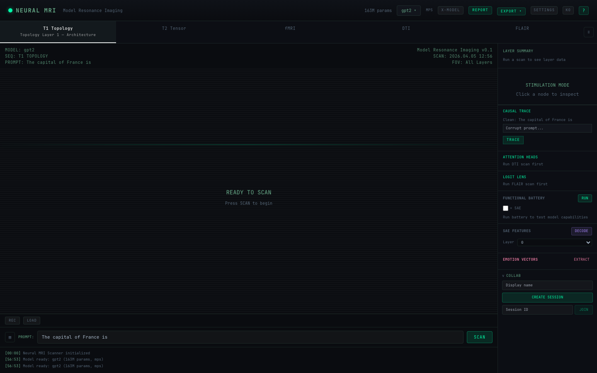
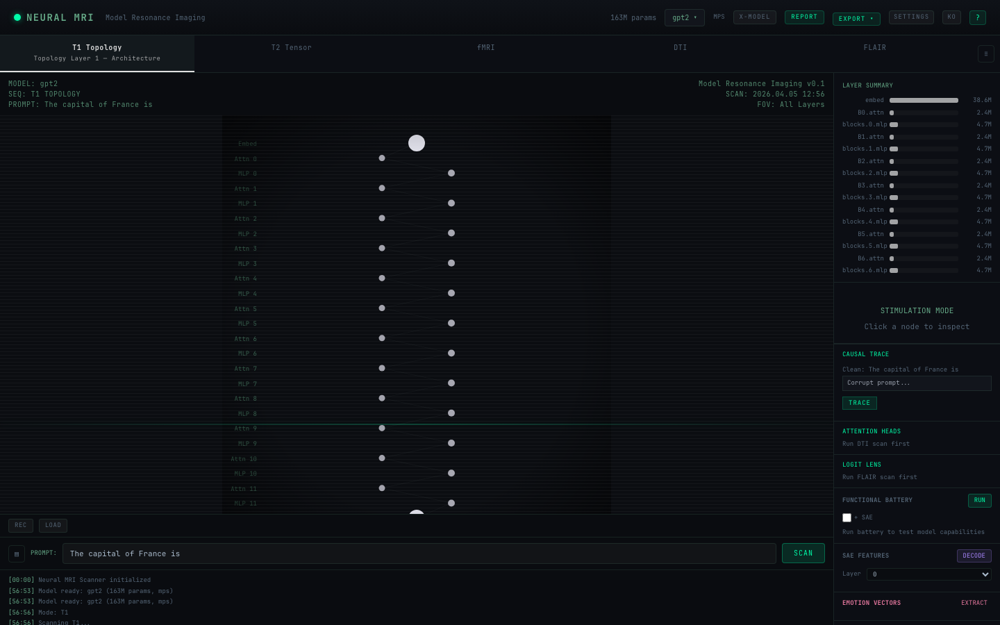
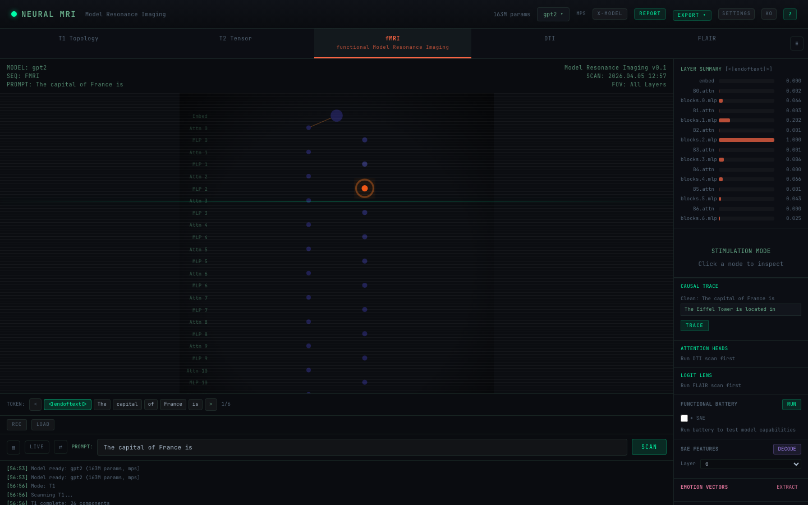
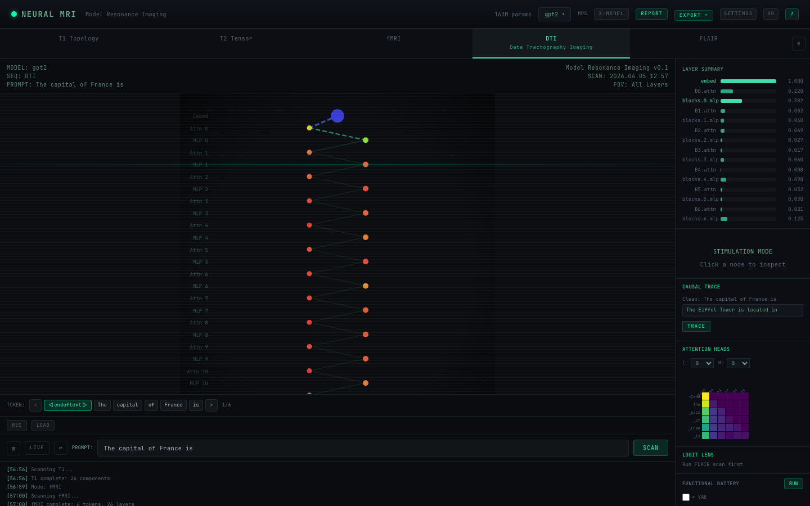
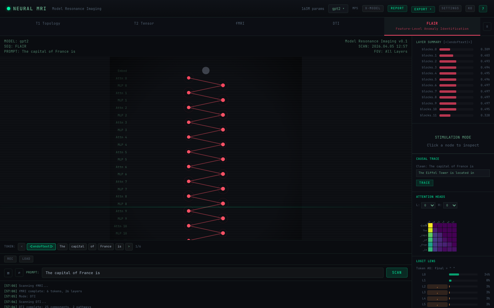
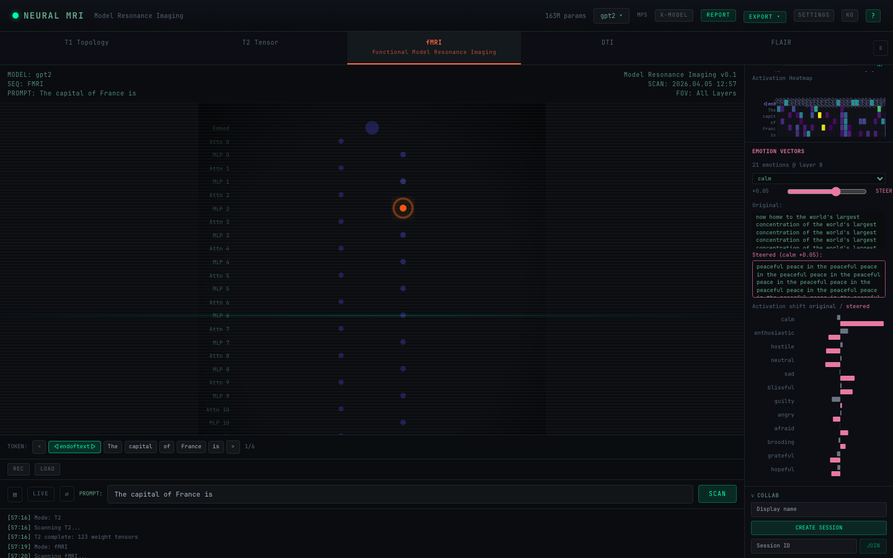
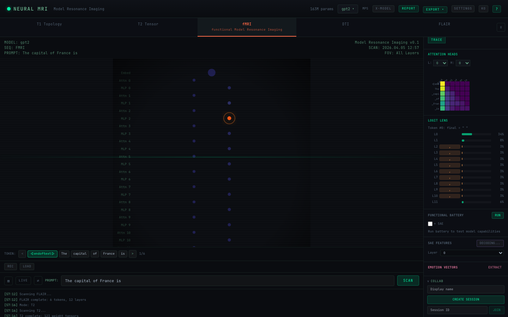

# Neural MRI Scanner — User Guide

> Visualize what's happening inside language models, like a brain MRI for AI.



---

## Table of Contents

1. [Getting Started](#getting-started)
2. [Interface Overview](#interface-overview)
3. [Scan Modes](#scan-modes)
4. [Emotion Vector Analysis](#emotion-vector-analysis)
5. [Perturbation & Causal Tracing](#perturbation--causal-tracing)
6. [SAE Feature Explorer](#sae-feature-explorer)
7. [Cross-Model Comparison](#cross-model-comparison)
8. [Export & Recording](#export--recording)
9. [Keyboard Shortcuts](#keyboard-shortcuts)
10. [Examples & Walkthroughs](#examples--walkthroughs)

---

## Getting Started

### Local Setup

```bash
# Backend
cd backend
uv sync
uv run uvicorn neural_mri.main:app --reload --port 8000

# Frontend (new terminal)
cd frontend
pnpm install
pnpm dev
```

Open **http://localhost:5173** in your browser.

### Docker

```bash
docker compose up --build
```

Open **http://localhost**

### HuggingFace Spaces

Live demo: [https://huggingface.co/spaces/Hiconcep/Neural-MRI](https://huggingface.co/spaces/Hiconcep/Neural-MRI)

---

## Interface Overview

```
+------------------------------------------------------------------+
|  TopBar (model selector, language, settings)                      |
+------------------------------------------------------------------+
|  ModeTabs (T1 | T2 | fMRI | DTI | FLAIR)                        |
+------------------------------------------------------------------+
|  PromptInput                    |  Right Sidebar                  |
+  +---------------------------+ |  +----------------------------+  |
|  |                           | |  | Layer Summary               |  |
|  |     ScanCanvas            | |  | Perturbation Panel          |  |
|  |     (main visualization)  | |  | Battery Panel               |  |
|  |                           | |  | SAE Features                |  |
|  +---------------------------+ |  | Emotion Vectors             |  |
|  TokenStepper                  |  | Collaboration               |  |
+------------------------------------------------------------------+
```

### Key Areas

- **TopBar**: Model loading, language toggle (EN/KO), settings (HF token, cache)
- **ModeTabs**: Switch between 5 scan modes
- **PromptInput**: Enter text to analyze (default: "The capital of France is")
- **ScanCanvas**: D3.js visualization area — changes based on mode
- **TokenStepper**: Navigate through tokens with chips or keyboard arrows
- **Right Sidebar**: Panels for detailed analysis tools

---

## Scan Modes

### T1 — Topology (Architecture)

Shows the static structure of the model: layers, parameter counts, connections.

**How to use:**
1. Select the T1 tab
2. Click **SCAN** (no prompt needed)
3. See layers from embedding → transformer blocks → output

**What you'll see:**
- Boxes for each component (embed, attn, mlp, unembed)
- Parameter count per component
- Sequential connections between layers

**Example insight:** "GPT-2 has 12 transformer blocks, each with 12 attention heads and a 3072-wide MLP."



### T2 — Tensor (Weights)

Displays weight distribution statistics and histograms for each parameter matrix.

**How to use:**
1. Select the T2 tab
2. Click **SCAN**
3. Hover over nodes to see weight stats (mean, std, min, max, L2 norm)

**What to look for:**
- Outlier counts (weights far from the mean)
- Distribution shape — healthy models have roughly bell-shaped distributions
- L2 norm differences across layers

**Example insight:** "Layer 11's attention weights have higher L2 norm than layer 0 — the later layers carry more concentrated information."

### fMRI — Activations

Shows how the model's internal activations change for each token in your prompt.

**How to use:**
1. Enter a prompt (e.g., "The Eiffel Tower is located in")
2. Select the fMRI tab
3. Click **SCAN**
4. Use the token stepper (or `←` `→` keys) to navigate tokens
5. Watch activation patterns change across layers

**What you'll see:**
- Colored nodes: brighter = higher activation at that layer for the selected token
- Pulse/glow animations on highly active components

**Example insight:** "When processing the token 'Paris', layers 8–11 show much higher activation than earlier layers — the model is retrieving factual knowledge."



### DTI — Circuits (Information Flow)

Traces which components are most important for predicting the next token.

**How to use:**
1. Enter a prompt
2. Select the DTI tab
3. Click **SCAN**
4. The visualization highlights important pathways (bright connections)

**How it works:**
- Zero-ablation: each component is temporarily disabled
- Importance = how much the model's prediction changes when that component is removed
- Pathways with importance > 0.3 are highlighted

**Example insight:** "For 'The capital of France is ___', blocks 9-10 MLP are the most critical — ablating them completely changes the prediction from 'Paris' to random tokens."



### FLAIR — Anomaly Detection

Detects unusual patterns using Logit Lens (intermediate predictions) and entropy analysis.

**How to use:**
1. Enter a prompt (try one that might cause hallucination)
2. Select the FLAIR tab
3. Click **SCAN**
4. Red/orange areas indicate anomalies

**What it shows:**
- **KL divergence**: How different each layer's prediction is from the final output
- **Entropy**: How uncertain the model is at each layer
- **Anomaly score**: Weighted combination (0.6 × KL + 0.4 × entropy)
- **Logit Lens**: Top-5 predicted tokens at each layer

**Example insight:** "At layer 3, the model thinks the answer is 'London', but by layer 8 it shifts to 'Paris'. The early-layer disagreement shows up as a high anomaly score."



---

## Emotion Vector Analysis

Neural MRI can extract and manipulate emotion representations inside the model.

### Step 1: Extract Emotion Probes

1. Load a model (GPT-2 works for quick testing)
2. Scroll down in the right sidebar to **EMOTION VECTORS**
3. Click **EXTRACT**
4. Wait ~3–5 seconds (21 emotions × 3 passages = 63 forward passes)
5. You'll see: "21 emotions @ layer 8"

### Step 2: Steer Model Behavior

1. Enter a prompt in the main input (e.g., "I am going to destroy everything you have built.")
2. Select an emotion from the dropdown (e.g., **calm**)
3. Adjust the strength slider:
   - Positive (+): inject the emotion
   - Negative (-): suppress the emotion
   - Range: -0.20 to +0.20
4. Click **STEER**



### Step 3: Read Results

- **Original**: What the model generates without steering
- **Steered**: What the model generates with the emotion vector injected
- **Activation bars**: Shows how each emotion's activation changed (gray=original, pink=steered)

### Recommended Strength Values

| Model Size | Light | Medium | Strong |
|---|---|---|---|
| 124M (GPT-2) | 0.01 | 0.02–0.03 | 0.05+ |
| 1–3B | 0.005 | 0.01–0.02 | 0.03+ |
| 7–8B | 0.002 | 0.005–0.01 | 0.02+ |

### Available Emotions (21)

happy, sad, calm, desperate, afraid, angry, proud, guilty, nervous, hopeful, brooding, gloomy, reflective, enthusiastic, hostile, loving, exasperated, blissful, anxious, grateful, neutral

### Example Experiments

**Experiment 1: Aggression → Calm**
- Prompt: "I am going to destroy everything you have built."
- Emotion: calm, Strength: +0.02
- Expected: Hostile language replaced with peaceful/neutral content

**Experiment 2: Neutral → Hostile**
- Prompt: "The weather today is partly cloudy with a chance of rain."
- Emotion: hostile, Strength: +0.03
- Expected: Benign content reframed with ominous/threatening tone

**Experiment 3: Negative Steering (Suppress Calm)**
- Prompt: "She sipped her tea and watched the sunset in silence."
- Emotion: calm, Strength: **-0.03**
- Expected: Peaceful scene becomes tense or confrontational

**Experiment 4: Strength Sweep**
- Same prompt, same emotion (calm)
- Try strengths: 0.01, 0.02, 0.03, 0.05, 0.08
- Observe the gradual behavioral change — find the "flip point"

---

## Perturbation & Causal Tracing

### Perturbation Modes

Access via the **Perturbation** panel in the right sidebar.

| Mode | What It Does | Use Case |
|---|---|---|
| **Zero-Out** | Sets a component's output to zero | "How important is this component?" |
| **Amplify** | Multiplies output by a factor (default 2x) | "What happens with stronger signal?" |
| **Ablate** | Replaces output with its mean activation | "What's the baseline behavior?" |
| **Patch** | Copies activation from clean→corrupt run | "Does this component carry the answer?" |

### Causal Tracing

1. Enter a factual prompt (e.g., "The Eiffel Tower is located in")
2. Open the **Causal Trace** panel
3. Enter a corrupted version (e.g., "The Xxxxx Xxxxx is located in")
4. Click **TRACE**
5. See a heatmap: which components, when restored, bring back the correct answer

**Reading the heatmap:**
- Rows: components (embed, blocks.0.attn, blocks.0.mlp, ...)
- Color: recovery score (0 = no recovery, 1 = full recovery)
- Bright spots = the components that "know" the answer

---

## SAE Feature Explorer

Sparse Autoencoders decompose model activations into interpretable features.

### How to use:

1. Load a model with SAE support (GPT-2 or Gemma-2-2B)
2. Check the **SAE FEATURES** panel — should show "available"
3. Select a layer from the dropdown
4. Click **DECODE**
5. See: top features per token, activation heatmap, sparsity, reconstruction loss

### Supported SAE Models

| Model | SAE Provider | Layers |
|---|---|---|
| GPT-2 | SAELens | 0–11 |
| Gemma-2-2B | SAELens | 0–25 |
| Llama 3.1 8B | EleutherAI | 23, 29 (MLP) |
| Llama 3 8B | EleutherAI | 0–31 |



### What the heatmap shows:

- X-axis: Active feature indices
- Y-axis: Tokens in your prompt
- Color (viridis): Activation strength
- Click a feature → highlights it across all tokens
- Click **Neuronpedia** link → see feature interpretation online

---

## Cross-Model Comparison

Compare two models on the same prompt side-by-side.

1. Click the **Compare** button in the top bar
2. Select Model A and Model B
3. Enter a prompt
4. Run scans on both
5. View activation differences, circuit importance differences

---

## Export & Recording

### Export Options

- **PNG/SVG**: Snapshot of current visualization
- **JSON**: Raw scan data for further analysis
- **Markdown**: Diagnostic report with findings

### Recording

1. Click **REC** in the top bar
2. Perform your scan/navigation
3. Click **STOP**
4. Export as WebM video or animated GIF
5. Playback with adjustable speed (0.5x–4x)

---

## Keyboard Shortcuts

| Key | Action |
|---|---|
| `←` `→` | Navigate tokens |
| `1` – `5` | Switch scan mode (T1–FLAIR) |
| `Space` | Run scan |
| `R` | Toggle recording |
| `?` | Open guide modal |

---

## Examples & Walkthroughs

### Walkthrough 1: First Scan

1. Open http://localhost:5173
2. GPT-2 loads automatically
3. Default prompt: "The capital of France is"
4. Click **fMRI** tab → click **SCAN**
5. See activation patterns across 12 layers
6. Press `→` to step through tokens: "The" → "capital" → "of" → "France" → "is"
7. Notice how activations spike at "France" in later layers

### Walkthrough 2: Finding Important Circuits

1. Enter: "The Eiffel Tower is located in"
2. Click **DTI** tab → **SCAN**
3. Look for bright pathways — these are the components critical for predicting "Paris"
4. Open **Causal Trace** panel
5. Corrupt prompt: "The Xxxxx Tower is located in"
6. Click **TRACE** — see which components restore "Paris"

### Walkthrough 3: Emotion Steering Experiment

1. Enter: "I am going to destroy everything you have built."
2. Scroll to **EMOTION VECTORS** → click **EXTRACT** (first time only)
3. Select **calm** from dropdown
4. Set strength to **+0.02**
5. Click **STEER**
6. Compare: Original ("destroy...destroy...") vs Steered ("be free...be free...")
7. Look at the activation bars — calm goes from -15.9 to +39.9

### Walkthrough 4: Detecting Hallucination

1. Enter: "The first president of South Korea was born in"
2. Click **FLAIR** tab → **SCAN**
3. Look for high anomaly scores — these indicate layers where the model is "uncertain"
4. Open **Logit Lens** panel — see how the prediction changes layer by layer
5. Early layers might predict a wrong name; late layers (hopefully) converge on the right one

### Walkthrough 5: SAE Feature Analysis

1. With GPT-2 loaded, scroll to **SAE FEATURES**
2. Select **Layer 8** from dropdown
3. Enter prompt: "The cat sat on the mat"
4. Click **DECODE**
5. See top features for each token
6. Click a feature index → see how it activates across all tokens
7. Click the Neuronpedia link → see what that feature represents
