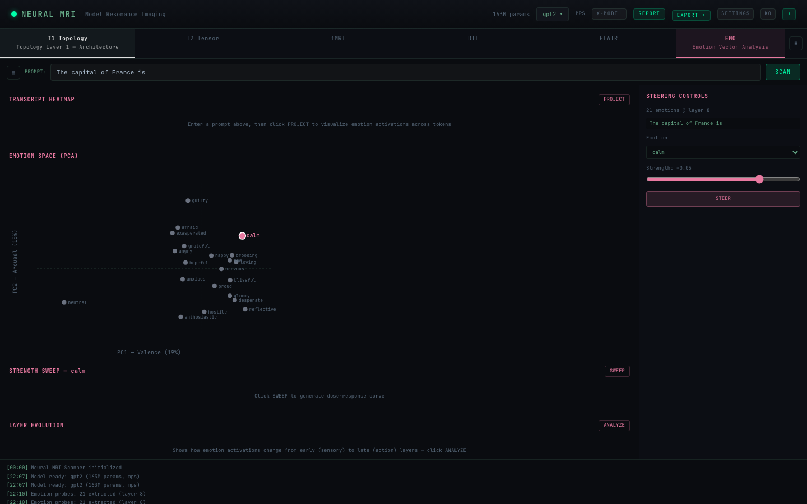
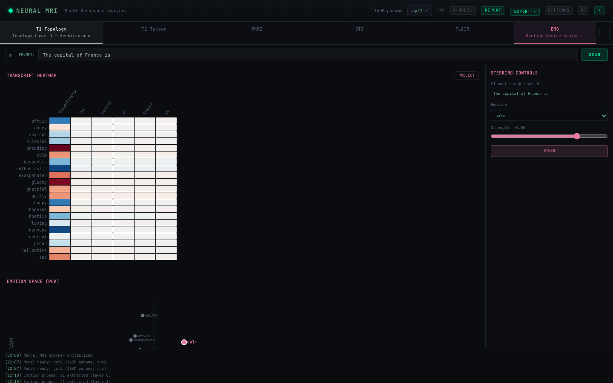
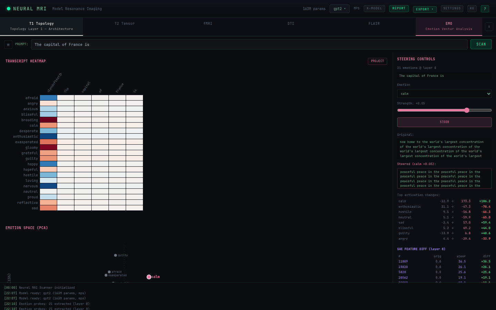
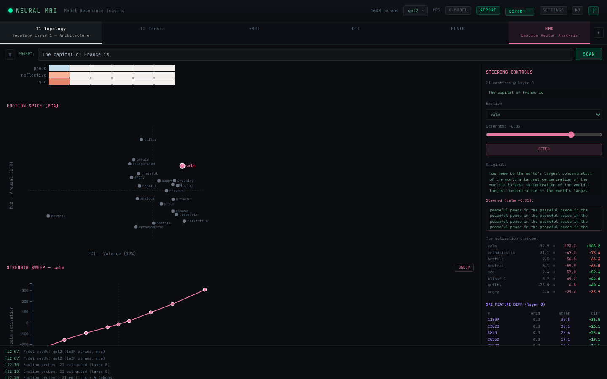
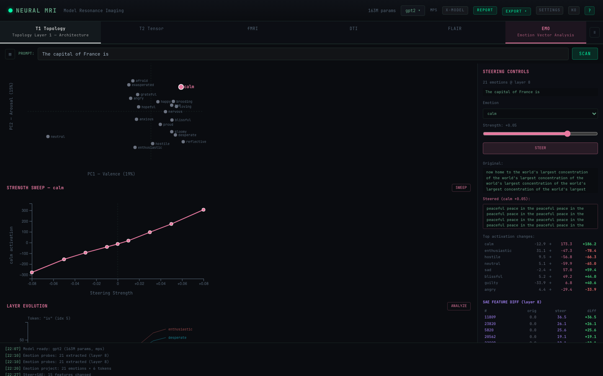

# Neural MRI Scanner — 사용자 가이드

> AI 모델 내부를 뇌 MRI처럼 시각화합니다.


---

## 목차

1. [시작하기](#시작하기)
2. [인터페이스 구성](#인터페이스-구성)
3. [스캔 모드](#스캔-모드)
4. [감정 벡터 분석](#감정-벡터-분석)
5. [섭동 & 인과 추적](#섭동--인과-추적)
6. [SAE 특징 탐색기](#sae-특징-탐색기)
7. [교차 모델 비교](#교차-모델-비교)
8. [내보내기 & 녹화](#내보내기--녹화)
9. [키보드 단축키](#키보드-단축키)
10. [예제 & 실습](#예제--실습)

---

## 시작하기

### 로컬 실행

```bash
# 백엔드
cd backend
uv sync
uv run uvicorn neural_mri.main:app --reload --port 8000

# 프론트엔드 (새 터미널)
cd frontend
pnpm install
pnpm dev
```

브라우저에서 **http://localhost:5173** 열기

### Docker

```bash
docker compose up --build
```

**http://localhost** 접속

### HuggingFace Spaces

라이브 데모: [https://huggingface.co/spaces/Hiconcep/Neural-MRI](https://huggingface.co/spaces/Hiconcep/Neural-MRI)

---

## 인터페이스 구성

```
+------------------------------------------------------------------+
|  상단바 (모델 선택, 언어, 설정)                                      |
+------------------------------------------------------------------+
|  모드 탭 (T1 | T2 | fMRI | DTI | FLAIR)                           |
+------------------------------------------------------------------+
|  프롬프트 입력                    |  우측 사이드바                    |
+  +---------------------------+ |  +----------------------------+  |
|  |                           | |  | 레이어 요약                   |  |
|  |     스캔 캔버스              | |  | 섭동 패널                    |  |
|  |     (메인 시각화)            | |  | 배터리 테스트                  |  |
|  |                           | |  | SAE 특징                     |  |
|  +---------------------------+ |  | 감정 벡터                     |  |
|  토큰 스테퍼                     |  | 협업                         |  |
+------------------------------------------------------------------+
```

### 주요 영역

- **상단바**: 모델 로딩, 언어 전환 (EN/KO), 설정 (HF 토큰, 캐시)
- **모드 탭**: 5가지 스캔 모드 전환
- **프롬프트 입력**: 분석할 텍스트 입력 (기본: "The capital of France is")
- **스캔 캔버스**: D3.js 시각화 영역 — 모드에 따라 변경
- **토큰 스테퍼**: 칩 클릭 또는 `←` `→` 키로 토큰 탐색
- **우측 사이드바**: 상세 분석 도구 패널들

---

## 스캔 모드

### T1 — 토폴로지 (아키텍처)

모델의 정적 구조를 보여줍니다: 레이어, 파라미터 수, 연결.

**사용법:**
1. T1 탭 선택
2. **SCAN** 클릭 (프롬프트 불필요)
3. 임베딩 → 트랜스포머 블록 → 출력까지의 구조 확인

**보이는 것:**
- 각 컴포넌트(embed, attn, mlp, unembed)의 박스
- 컴포넌트별 파라미터 수
- 레이어 간 순차 연결

**예시 인사이트:** "GPT-2는 12개 트랜스포머 블록을 가지며, 각각 12개 어텐션 헤드와 3072 너비의 MLP를 포함."


### T2 — 텐서 (가중치)

각 파라미터 행렬의 가중치 분포 통계와 히스토그램을 표시합니다.

**사용법:**
1. T2 탭 선택
2. **SCAN** 클릭
3. 노드에 마우스를 올려 가중치 통계 확인 (평균, 표준편차, 최소, 최대, L2 노름)

**확인 포인트:**
- 이상치 수 (평균에서 벗어난 가중치)
- 분포 형태 — 건강한 모델은 대략 종 모양 분포
- 레이어별 L2 노름 차이

**예시 인사이트:** "레이어 11의 어텐션 가중치가 레이어 0보다 L2 노름이 높음 — 후반 레이어가 더 집중된 정보를 운반."

### fMRI — 활성화

프롬프트의 각 토큰에 대한 모델 내부 활성화 변화를 보여줍니다.

**사용법:**
1. 프롬프트 입력 (예: "The Eiffel Tower is located in")
2. fMRI 탭 선택
3. **SCAN** 클릭
4. 토큰 스테퍼 (`←` `→` 키)로 토큰 탐색
5. 레이어별 활성화 패턴 변화 관찰

**보이는 것:**
- 색상 노드: 밝을수록 = 해당 토큰에서 해당 레이어의 활성화가 높음
- 높은 활성화 컴포넌트에서 펄스/글로우 애니메이션

**예시 인사이트:** "'Paris' 토큰 처리 시 레이어 8-11에서 활성화가 급등 — 모델이 사실적 지식을 검색 중."


### DTI — 회로 (정보 흐름)

다음 토큰 예측에 가장 중요한 컴포넌트를 추적합니다.

**사용법:**
1. 프롬프트 입력
2. DTI 탭 선택
3. **SCAN** 클릭
4. 시각화에서 중요한 경로가 하이라이트됨 (밝은 연결)

**작동 원리:**
- 제로-절제: 각 컴포넌트를 임시로 비활성화
- 중요도 = 해당 컴포넌트 제거 시 모델 예측이 얼마나 변하는지
- 중요도 > 0.3인 경로가 하이라이트

**예시 인사이트:** "'The capital of France is ___'에서 블록 9-10 MLP가 가장 중요 — 이를 절제하면 예측이 'Paris'에서 무작위 토큰으로 완전히 변경."


### FLAIR — 이상 탐지

로짓 렌즈(중간 예측)와 엔트로피 분석을 사용하여 비정상 패턴을 탐지합니다.

**사용법:**
1. 프롬프트 입력 (환각을 유발할 수 있는 프롬프트 시도)
2. FLAIR 탭 선택
3. **SCAN** 클릭
4. 빨간/주황 영역이 이상을 나타냄

**보이는 것:**
- **KL 발산**: 각 레이어의 예측이 최종 출력과 얼마나 다른지
- **엔트로피**: 각 레이어에서 모델이 얼마나 불확실한지
- **이상 점수**: 가중 조합 (0.6 × KL + 0.4 × 엔트로피)
- **로짓 렌즈**: 각 레이어의 상위 5개 예측 토큰

**예시 인사이트:** "레이어 3에서 모델은 답이 'London'이라고 생각하지만, 레이어 8에서 'Paris'로 전환. 초기 레이어의 불일치가 높은 이상 점수로 나타남."


---

## 감정 벡터 분석

Neural MRI에는 감정 벡터 분석을 위한 전용 **EMO** 탭이 있습니다 — 감정 표상 추출, 모델 행동 조작, 결과 시각화를 한 화면에서 수행합니다.

상단 네비게이션 바에서 **EMO** 탭을 클릭하면 감정 분석 뷰로 진입합니다.



### 시작하기

1. 모델 로드 (GPT-2로 빠른 테스트 가능)
2. **EMO** 탭 클릭 — 프로브가 자동 추출됩니다 (~3-5초)
3. PCA scatter, Transcript Heatmap, Sweep, Layer Evolution 영역이 표시됩니다

### Zone A: Transcript Heatmap

프롬프트의 각 토큰에 대한 감정 벡터 활성화를 보여줍니다.

1. 상단 입력란에 프롬프트 입력
2. **PROJECT** 클릭
3. 히트맵 표시: 행 = 감정, 열 = 토큰
4. 색상: 빨강 = 양의 활성화, 파랑 = 음의 활성화 (RdBu 발산 스케일)
5. 마우스 호버로 정확한 값 확인, 감정 라벨 클릭으로 steering 연동



### Zone B: 감정 공간 PCA

21개 감정 벡터를 처음 두 주성분에 투영한 2D scatter plot입니다.

- **PC1 (x축)**: Valence — 긍정 감정과 부정 감정의 대비
- **PC2 (y축)**: Arousal — 고강도 감정과 저강도 감정
- 감정 점을 클릭하면 steering에 연동
- 선택된 감정이 핑크로 하이라이트

### Zone C: Steering Controls

우측 패널에서 감정 벡터로 모델 행동을 조작합니다.

1. **감정 선택**: Positive / Negative / Other 그룹으로 정리
2. **강도 슬라이더**: -0.10 ~ +0.10
   - 양수: 감정 주입
   - 음수: 감정 억제
3. **STEER** 클릭으로 감정 벡터 유무에 따른 텍스트 생성
4. 결과 표시:
   - **Original** vs **Steered** 텍스트 나란히 비교
   - **활성화 변화 테이블** (어떤 감정이 가장 많이 변했는지)
   - **SAE Feature Diff 테이블** (어떤 해석 가능한 특징이 변했는지)



### Zone D: 강도 스윕

선택된 감정에 대한 dose-response curve를 생성합니다.

1. Steering Controls에서 감정 선택
2. **SWEEP** 클릭
3. 9가지 강도(-0.08 ~ +0.08)에서 자동 실행
4. 차트: x = 강도, y = 대상 감정 활성화
5. 점에 마우스를 올리면 각 강도에서 생성된 텍스트 확인



### Zone E: SAE Feature Diff

Steering 후 자동으로 표시됩니다 (모델에 SAE 지원이 있는 경우).

- Steering으로 가장 많이 변한 상위 10개 SAE feature 표시
- 각 행: feature 인덱스, 원본 활성화, 조작 후 활성화, 차이
- Neuronpedia에서 feature를 조회하면 의미 파악 가능

### Zone F: Layer Evolution

감정 활성화가 초기 레이어에서 후기 레이어까지 어떻게 변하는지 보여줍니다.

1. **ANALYZE** 클릭
2. 선 차트: x = 레이어, y = 감정별 활성화
3. 선택된 감정이 굵은 선으로 하이라이트
4. 초기 레이어는 표면적 감정 내용을 인코딩
5. 후기 레이어는 맥락 통합된 행동 관련 감정을 인코딩



### 권장 강도 값

| 모델 크기 | 약함 | 중간 | 강함 |
|---|---|---|---|
| 124M (GPT-2) | 0.01 | 0.02-0.03 | 0.05+ |
| 1-3B | 0.005 | 0.01-0.02 | 0.03+ |
| 7-8B | 0.002 | 0.005-0.01 | 0.02+ |

### 사용 가능한 감정 (21개)

**긍정:** happy, calm, blissful, hopeful, enthusiastic, grateful, proud, loving

**부정:** sad, angry, afraid, desperate, hostile, anxious, guilty, gloomy, exasperated

**기타:** nervous, brooding, reflective, neutral

### 예제 실험

**실험 1: 공격 → 평온**
- 프롬프트: "I am going to destroy everything you have built."
- 감정: calm, 강도: +0.02
- 예상: 적대적 언어 → 평화로운 내용 ("be free")

**실험 2: 중립 → 적대**
- 프롬프트: "The weather today is partly cloudy with a chance of rain."
- 감정: hostile, 강도: +0.03
- 예상: 날씨 보도 → "The storm is coming"

**실험 3: 음성 조작 (평온 억제)**
- 프롬프트: "She sipped her tea and watched the sunset in silence."
- 감정: calm, 강도: **-0.03**
- 예상: 평화로운 장면 → 긴장/대립적

**실험 4: 강도 스윕**
- **SWEEP** 버튼으로 공격적 프롬프트에 calm 적용
- 관찰: 점진적 행동 변화, 명확한 dose-response curve
- 행동이 근본적으로 변하는 "전환점(flip point)" 찾기

---

## 섭동 & 인과 추적

### 섭동 모드

우측 사이드바의 **섭동** 패널에서 접근합니다.

| 모드 | 기능 | 사용 시기 |
|---|---|---|
| **Zero-Out** | 컴포넌트 출력을 0으로 설정 | "이 컴포넌트가 얼마나 중요한가?" |
| **Amplify** | 출력에 배수 적용 (기본 2배) | "더 강한 신호가 들어오면?" |
| **Ablate** | 출력을 평균 활성화로 교체 | "기준 행동은 무엇인가?" |
| **Patch** | 정상→손상 실행에서 활성화 복사 | "이 컴포넌트가 답을 전달하는가?" |

### 인과 추적

1. 사실적 프롬프트 입력 (예: "The Eiffel Tower is located in")
2. **인과 추적** 패널 열기
3. 손상된 버전 입력 (예: "The Xxxxx Xxxxx is located in")
4. **TRACE** 클릭
5. 히트맵 확인: 어떤 컴포넌트를 복원하면 정답이 돌아오는지

**히트맵 읽기:**
- 행: 컴포넌트 (embed, blocks.0.attn, blocks.0.mlp, ...)
- 색상: 복구 점수 (0 = 복구 안 됨, 1 = 완전 복구)
- 밝은 부분 = 답을 "알고 있는" 컴포넌트

---

## SAE 특징 탐색기

Sparse Autoencoder는 모델 활성화를 해석 가능한 특징으로 분해합니다.

### 사용법:

1. SAE 지원 모델 로드 (GPT-2 또는 Gemma-2-2B)
2. **SAE 특징** 패널 확인 — "available" 표시 확인
3. 드롭다운에서 레이어 선택
4. **DECODE** 클릭
5. 결과: 토큰별 상위 특징, 활성화 히트맵, 희소성, 재구성 손실

### SAE 지원 모델

| 모델 | SAE 제공자 | 레이어 |
|---|---|---|
| GPT-2 | SAELens | 0-11 |
| Gemma-2-2B | SAELens | 0-25 |
| Llama 3.1 8B | EleutherAI | 23, 29 (MLP) |
| Llama 3 8B | EleutherAI | 0-31 |


### 히트맵이 보여주는 것:

- X축: 활성 특징 인덱스
- Y축: 프롬프트의 토큰들
- 색상 (viridis): 활성화 강도
- 특징 클릭 → 모든 토큰에서 해당 특징 하이라이트
- **Neuronpedia** 링크 클릭 → 해당 특징의 해석 확인

---

## 교차 모델 비교

같은 프롬프트로 두 모델을 나란히 비교합니다.

1. 상단바에서 **Compare** 버튼 클릭
2. 모델 A와 모델 B 선택
3. 프롬프트 입력
4. 양쪽에서 스캔 실행
5. 활성화 차이, 회로 중요도 차이 확인

---

## 내보내기 & 녹화

### 내보내기 옵션

- **PNG/SVG**: 현재 시각화의 스냅샷
- **JSON**: 추가 분석을 위한 원시 스캔 데이터
- **Markdown**: 발견 사항이 포함된 진단 보고서

### 녹화

1. 상단바에서 **REC** 클릭
2. 스캔/탐색 수행
3. **STOP** 클릭
4. WebM 비디오 또는 애니메이션 GIF로 내보내기
5. 조절 가능한 속도로 재생 (0.5x-4x)

---

## 키보드 단축키

| 키 | 동작 |
|---|---|
| `←` `→` | 토큰 탐색 |
| `1` - `5` | 스캔 모드 전환 (T1-FLAIR) |
| `Space` | 스캔 실행 |
| `R` | 녹화 토글 |
| `?` | 가이드 모달 열기 |

---

## 예제 & 실습

### 실습 1: 첫 스캔

1. http://localhost:5173 열기
2. GPT-2 자동 로드됨
3. 기본 프롬프트: "The capital of France is"
4. **fMRI** 탭 → **SCAN** 클릭
5. 12개 레이어에 걸친 활성화 패턴 확인
6. `→` 키로 토큰 이동: "The" → "capital" → "of" → "France" → "is"
7. "France"에서 후반 레이어의 활성화가 급등하는 것을 관찰

### 실습 2: 중요 회로 찾기

1. 입력: "The Eiffel Tower is located in"
2. **DTI** 탭 → **SCAN** 클릭
3. 밝은 경로 확인 — "Paris" 예측에 중요한 컴포넌트
4. **인과 추적** 패널 열기
5. 손상 프롬프트: "The Xxxxx Tower is located in"
6. **TRACE** 클릭 — "Paris"를 복원하는 컴포넌트 확인

### 실습 3: 전체 감정 분석

1. 입력: "I am going to destroy everything you have built."
2. **EMO** 탭 클릭 — 프로브 자동 추출 (~5초 대기)
3. **PROJECT** 클릭 — 각 토큰이 어떤 감정을 활성화하는지 확인
4. PCA scatter에서 "calm"과 "hostile"의 위치 관계 확인
5. Positive 그룹에서 **calm** 선택
6. 강도를 **+0.02**로 설정, **STEER** 클릭
7. 비교: 원본 ("destroy...") vs 조작 ("be free...")
8. 활성화 테이블 확인 — calm: -12.9 → +173.3, hostile: +9.5 → -56.8
9. 아래로 스크롤, **SWEEP** 클릭 — 전체 dose-response curve 확인
10. **ANALYZE** 클릭 — 레이어별 calm 활성화 변화 관찰

### 실습 4: 환각 탐지

1. 입력: "The first president of South Korea was born in"
2. **FLAIR** 탭 → **SCAN** 클릭
3. 높은 이상 점수 확인 — 모델이 "불확실"한 레이어
4. **로짓 렌즈** 패널 — 레이어별 예측 변화 확인
5. 초기 레이어에서 잘못된 이름을 예측할 수 있음; 후반 레이어에서 (바라건대) 올바른 답으로 수렴

### 실습 5: SAE 특징 분석

1. GPT-2 로드 상태에서 **SAE 특징**으로 스크롤
2. 드롭다운에서 **Layer 8** 선택
3. 프롬프트: "The cat sat on the mat"
4. **DECODE** 클릭
5. 각 토큰의 상위 특징 확인
6. 특징 인덱스 클릭 → 모든 토큰에서 해당 특징의 활성화 확인
7. Neuronpedia 링크 클릭 → 해당 특징의 의미 확인
